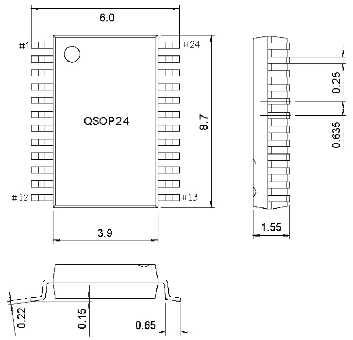

<!-- source-page: 69 -->

[← p.68](0068.md) · [index](../README.md) · [PDF p.69](https://ch32-riscv-ug.github.io/CH32V006/datasheet_en/CH32V007DS0.PDF#page=69) · [p.70 →](0070.md)

<!-- header: CH32V007/M007 Datasheet https://wch-ic.com -->
<em>Note: All dimensions are in millimeters. The pin center spacing values are nominal values, with no error. Other</em>  
<em>than that, the dimensional error is not greater than the greater of ±0.2mm or 10%.</em>  

## 4.1 QSOP24 Package

 <!-- p69-draw-image-00002 rendered from the PDF -->

<!-- image: p69-draw-image-00001 bbox=[518.88, 784.08, 538.32, 794.28] -->
<!-- footer: V1.8 67 -->
