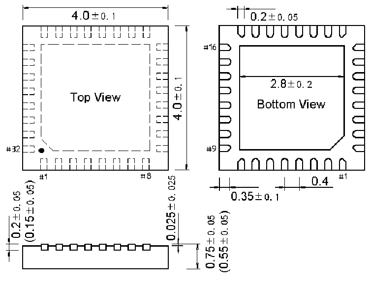

<!-- source-page: 71 -->

[← p.70](0070.md) · [index](../README.md) · [PDF p.71](https://ch32-riscv-ug.github.io/CH32V006/datasheet_en/CH32V007DS0.PDF#page=71) · [p.72 →](0072.md)

<!-- header: CH32V007/M007 Datasheet https://wch-ic.com -->

## 4.4 QFN32 Package

 <!-- p71-draw-image-00002 rendered from the PDF -->

<!-- image: p71-draw-image-00001 bbox=[518.88, 784.08, 538.32, 794.28] -->
<!-- footer: V1.8 69 -->
