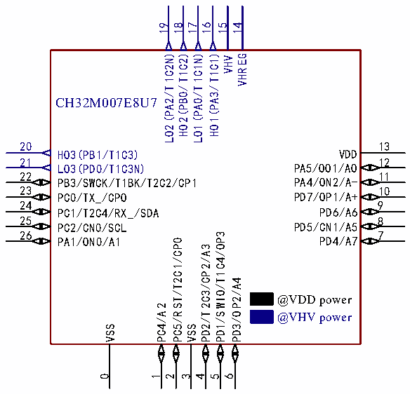

<!-- source-page: 16 -->

[← p.15](0015.md) · [index](../README.md) · [PDF p.16](https://ch32-riscv-ug.github.io/CH32V006/datasheet_zh/CH32V007DS0.PDF#page=16) · [p.17 →](0017.md)

<!-- header: CH32V007/M007数据手册 https://wch.cn -->
CH32M007E8R6  
1 24  
PD1/SWIO/T1C4/OP3 PA1/ON0/A1  
2 23  
PD2/T2C3/CP2/A3 PC5/RST/T2C1/CP0  
3 22  
PD3/OP2/A4 PC4/A2  
4 21  
PD4/A7 PC2/CN0/SCL  
5 20  
PD5/CN1/A5 PC1/T2C4/SDA  
6 19  
PD6/A6 PB3/SWCK/T1BK/T2C2/CP1  
7 18  
PD7/OP1/A+ LO3(PD0/T1C3N)  
8 17  
PA4/ON2/A- HO3(PB1/T1C3)  
16  
9  
PA5/OO1/AO LO2(PA2/T1C2N)  
10 15  
VDD HO2(PB0/T1C2)  
11 14  
VSS @VDD power LO1(PA0/T1C1N)  
12 13  
VHV @VHV power HO1(PA3/T1C1)  

 <!-- p16-cluster-01 uncaptioned graphics, rendered from the PDF; verify at https://ch32-riscv-ug.github.io/CH32V006/datasheet_zh/CH32V007DS0.PDF#page=16 -->

🖼 Text parsed from the figure above

19 18 17 16 14  
15  
LO2(PA2/T1C2N) HO2(PB0/T1C2) LO1(PA0/T1C1N) HO1(PA3/T1C1) VHV VHREG  
CH32M007E8U7  
20  
13  
VDD  
HO3(PB1/T1C3)  
21  
12  
PA5/OO1/AO  
LO3(PD0/T1C3N)  
22 11  
PA4/ON2/A-  
PB3/SWCK/T1BK/T2C2/CP1  
23 10  
PD7/OP1/A+  
PC0/TX_/CPO  
24 9  
PD6/A6  
PC1/T2C4/RX_/SDA  
25 8  
PD5/CN1/A5  
PC2/CN0/SCL  
26 7 PD4/A7  
PD1/SWIO/T1C4/OP3  
PA1/ON0/A1  
PC5/RST/T2C1/CP0  
PD2/T2C3/CP2/A3  
PD3/OP2/A4  
@VDD power  
PC4/A2  
@VHV power  
VSS  
VSS  
0  
1  
2  
3  
4  
5  
6  

注：引脚图中复用功能均为缩写。  
示例：A:ADC_ (A1:ADC_IN1、AET:ADC_RETR、AET2:ADC_IETR)  
T1:TIM1_ (T1C1:TIM1_CH1、T1C1N:TIM1_CH1N、T1BK:TIM1_BKIN)  
T2:TIM2_ (T2C1:TIM2_CH1_ETR、T2C2:TIM2_CH2)  
RX:USART1_RX  
TX:USART1_TX  
U2:USART2_ (U2RX:USART2_RX、U2TX:USART2_TX)  
O:OPA_ (OPP3或OP3:OPA_P3、OPNO或ON0:OPA_NO、OPO1或OO1:OPA_OUT1)  
C:CMP1_ (CP2:CMP1_P2、CN2:CMP1_N2、CPO:CMP1_OUT0)  
SDA:I2C_SDA  
SCL:I2C_SCL  
SCK:SPI_SCK  
NSS:SPI_NSS  
<!-- image: p16-draw-image-00001 bbox=[500.88, 779.28, 520.32, 789.6] -->
<!-- footer: V1.8 11 -->
