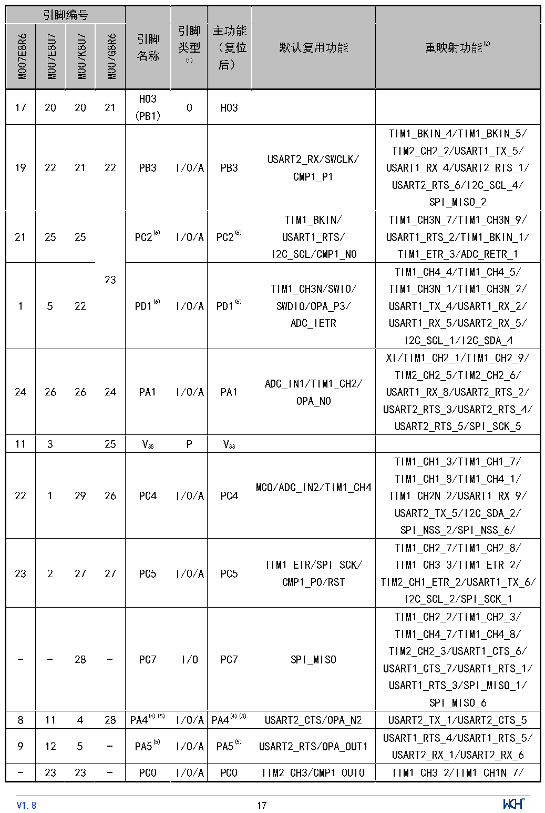

<!-- source-page: 22 -->

[← p.21](0021.md) · [index](../README.md) · [PDF p.22](https://ch32-riscv-ug.github.io/CH32V006/datasheet_zh/CH32V007DS0.PDF#page=22) · [p.23 →](0023.md)

<!-- header: CH32V007/M007数据手册 https://wch.cn -->

 <!-- p22-cluster-01 uncaptioned graphics, rendered from the PDF; verify at https://ch32-riscv-ug.github.io/CH32V006/datasheet_zh/CH32V007DS0.PDF#page=22 -->

🖼 Text parsed from the figure above

> ⬆ **Table continued** — rendered in full at [page 21](0021.md). <!-- p22-table-001 -->

<!-- image: p22-draw-image-00001 inside the figure -->
<!-- footer: V1.8 17 -->

