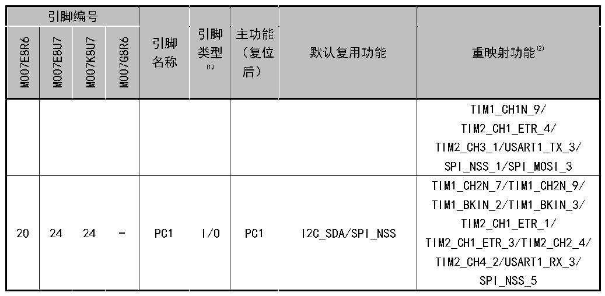

<!-- source-page: 23 -->

[← p.22](0022.md) · [index](../README.md) · [PDF p.23](https://ch32-riscv-ug.github.io/CH32V006/datasheet_zh/CH32V007DS0.PDF#page=23) · [p.24 →](0024.md)

<!-- header: CH32V007/M007数据手册 https://wch.cn -->

 <!-- p23-cluster-01 uncaptioned graphics, rendered from the PDF; verify at https://ch32-riscv-ug.github.io/CH32V006/datasheet_zh/CH32V007DS0.PDF#page=23 -->

🖼 Text parsed from the figure above

> ⬆ **Table continued** — rendered in full at [page 21](0021.md). <!-- p23-table-001 -->

注1：表格缩写解释：  
I = TTL/CMOS 电平斯密特输入；O = CMOS 电平三态输出；  
A = 模拟信号输入或输出；P = 电源。  
注2：重映射功能下划线后的数值表示AFIO寄存器中相对应位的配置值。例如：TIM1_BKIN_4表示AFIO  
寄存器相应位配置为100b。  
注3：对于CH32V007E8R6芯片，PA1与PA6引脚在芯片内部短接合封，禁止两个IO均配置为输出功能。  
注4：对于CH32M007K8U7和CH32M007G8R6芯片，通常选择PD7引脚作为运放的正端输入，PA4引脚作为运  
放的负端输入，PD4引脚作为运放的输出。  
注5：对于CH32M007E8芯片，通常选择PD7引脚作为运放的正端输入，PA4引脚作为运放的负端输入，PA5  
引脚作为运放的输出。  
注6：对于CH32M007G8R6芯片，PC2与PD1引脚在芯片内部短接合封，禁止两个IO均配置为输出功能。  

<!-- p23-table-002 (table-2-3@1) -->
<table><caption>表2-3 CH32M007K8U7和CH32M007G8R6专有引脚说明</caption><tr><th>引脚名称</th><th>引脚说明</th></tr><tr><td style="text-align:left">VCC12V</td><td style="text-align:left">内部低侧驱动器的电源输入及高压调节器的输出，需外接至少 4.7uF 容量的MLCC电容，建议10uF。</td></tr><tr><td style="text-align:left">VHV</td><td>内部高压调节器的电源输入。</td></tr><tr><td style="text-align:left">VDD</td><td>内部低压调节器的输出，需外接至少4.7uF容量的MLCC电容，建议10uF。</td></tr><tr><td>LO1,LO2,LO3</td><td>内部低侧栅极驱动器的输出，用于驱动N型MOSFET栅极。</td></tr><tr><td>HO1,HO2,HO3</td><td>内部高侧栅极驱动器的输出，用于驱动N型MOSFET栅极。</td></tr><tr><td style="text-align:left">V ,V ,V S1 S2 S3</td><td>内部高侧栅极驱动器的悬浮地。</td></tr><tr><td style="text-align:left">V ,V ,V B1 B2 B3</td><td style="text-align:left">内部高侧栅极驱动器的自举电源，建议外接1uF～4.7uF容量电容到各自的悬浮地V。 S</td></tr></table>

<!-- p23-table-003 (table-2-4@1) pages 23-24 -->
<table><caption>表2-4 CH32M007E8U7专有引脚说明</caption><tr><th>引脚名称</th><th>引脚说明</th></tr><tr><td style="text-align:left">VHV</td><td>主电源输入和栅极驱动器的电源输入，需外接至少3.3uF电容，建议10uF。</td></tr><tr><td style="text-align:left">VHREG</td><td style="text-align:left">内部电压调节器的电源输入，必须供电，一般通过电阻或直连V 。 HV</td></tr><tr><td style="text-align:left">VDD</td><td>内部电压调节器的输出，需外接至少4.7uF容量的MLCC电容，建议10uF。</td></tr><tr><td>LO1,LO2,LO3</td><td>内部低侧栅极驱动器的输出，用于驱动N型MOSFET栅极。</td></tr><tr><td>HO1,HO2,HO3</td><td>内部高侧栅极驱动器的输出，用于驱动P型MOSFET栅极。</td></tr></table>

<!-- image: p23-draw-image-00001 bbox=[500.88, 779.28, 520.32, 789.6] -->
<!-- footer: V1.8 18 -->
