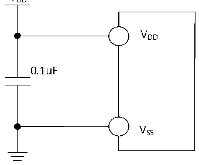
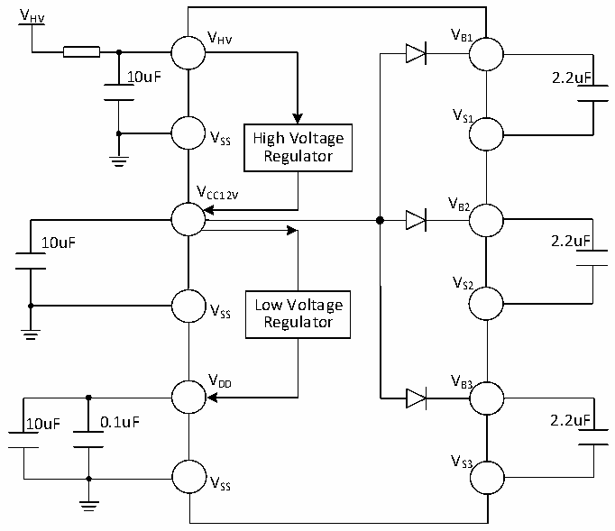

<!-- source-page: 27 -->

[← p.26](0026.md) · [index](../README.md) · [PDF p.27](https://ch32-riscv-ug.github.io/CH32V006/datasheet_zh/CH32V007DS0.PDF#page=27) · [p.28 →](0028.md)

<!-- header: CH32V007/M007数据手册 https://wch.cn -->

# 第 3 章 电气特性

## 3.1 测试条件

除非特殊说明和标注，所有电压都以VSS 为基准。  
所有最小值和最大值将在最坏的环境温度、供电电压和时钟频率条件下得到保证。  
CH32V007的典型数值是基于常温25℃和VDD= 3.3V或5V的环境。  
CH32M007K8U7 和 CH32M007G8R6 的典型数值是基于常温 25℃、供电 VHV= 24V、产生 VCC12V= 12V  
和VDD= 5V的环境。  
CH32M007E8U7的典型数值是基于常温25℃、供电VHV= 15V和VHREG= 7V、产生VDD= 5V的环境。  
CH32M007E8R6的典型数值是基于常温25℃、供电VHV= 15V、产生VDD= 5V的环境。  
对于通过综合评估、设计模拟或工艺特性得到的数据，不会在生产线进行测试。在综合评估的基  
础上，最小和最大值是通过样本测试后统计得到。除非特殊说明为实测值，否则特性参数以综合评估  
或设计保证。  
供电方案（图中电阻均可选，用于分摊压降减少芯片发热）：  

图3-1-1 CH32V007常规供电典型电路  
 <!-- rendered from the PDF; verify at https://ch32-riscv-ug.github.io/CH32V006/datasheet_zh/CH32V007DS0.PDF#page=27 -->

VDD  

🖼 Text parsed from the figure above

VDD  
0.1uF  
VSS  

图3-1-2 CH32M007K8U7和CH32M007G8R6常规供电典型电路  
 <!-- rendered from the PDF; verify at https://ch32-riscv-ug.github.io/CH32V006/datasheet_zh/CH32V007DS0.PDF#page=27 -->

🖼 Text parsed from the figure above

VHV  
V HV V B1  
10uF 2.2uF  
VS1  
V SS High Voltage  
Regulator  
V  
CC12V V  
B2  
10uF 2.2uF  
VS2  
V Low Voltage  
SS Regulator  
VDD VB3  
10uF 0.1uF 2.2uF  
VS3  
VSS  

<!-- image: p27-draw-image-00001 bbox=[502.8, 779.28, 522.24, 789.6] -->
<!-- footer: V1.8 22 -->
