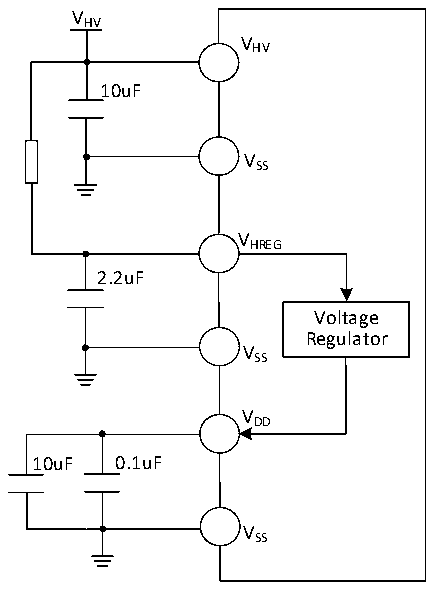
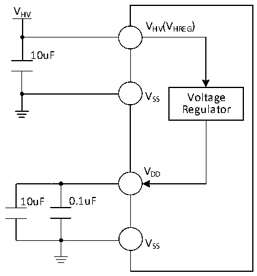

<!-- source-page: 28 -->

[← p.27](0027.md) · [index](../README.md) · [PDF p.28](https://ch32-riscv-ug.github.io/CH32V006/datasheet_zh/CH32V007DS0.PDF#page=28) · [p.29 →](0029.md)

<!-- header: CH32V007/M007数据手册 https://wch.cn -->

图3-1-3 CH32M007E8U7常规供电典型电路  
 <!-- rendered from the PDF; verify at https://ch32-riscv-ug.github.io/CH32V006/datasheet_zh/CH32V007DS0.PDF#page=28 -->

🖼 Text parsed from the figure above

VHV  
VHV  
10uF  
VSS  
VHREG  
2.2uF  
Voltage  
Regulator  
VSS  
VDD  
10uF 0.1uF  
VSS  

图3-1-4 CH32M007E8R6常规供电典型电路  
 <!-- rendered from the PDF; verify at https://ch32-riscv-ug.github.io/CH32V006/datasheet_zh/CH32V007DS0.PDF#page=28 -->

🖼 Text parsed from the figure above

VHV  
VHV(VHREG)  
10uF  
V SS Voltage  
Regulator  
VDD  
10uF 0.1uF  
VSS  

## 3.2 绝对最大值

临界或者超过绝对最大值将可能导致芯片工作不正常甚至损坏。  

<!-- p28-table-001 (table-3-1@1) pages 28-29 -->
<table><caption>表3-1 绝对最大值参数表</caption><tr><th>符号</th><th colspan="2">描述</th><th>最小值</th><th>最大值</th><th>单位</th></tr><tr><td rowspan="2" style="text-align:left">TA</td><td rowspan="2">工作时的环境温度</td><td>型号末位为6的芯片</td><td>-40</td><td>85</td><td>℃</td></tr><tr><td>型号末位为7的芯片</td><td>-40</td><td>105</td><td>℃</td></tr><tr><td style="text-align:left">TS</td><td colspan="2">存储时的环境温度</td><td>-40</td><td>125</td><td>℃</td></tr><tr><td rowspan="3" style="text-align:left">VDD</td><td style="text-align:left">外部主供电引脚V 上的电压DD</td><td>CH32V007</td><td>-0.3</td><td>5.5</td><td>V</td></tr><tr><td>内部低压调节器的输出电压</td><td style="text-align:left">CH32M007K8U7CH32M007G8R6</td><td>-0.3</td><td>5.5</td><td>V</td></tr><tr><td>内部电压调节器的输出电压</td><td>CH32M007E8</td><td>-0.3</td><td>5.5</td><td>V</td></tr><tr><td rowspan="2" style="text-align:left">VHV</td><td>内部高压调节器的输入电源电压</td><td style="text-align:left">CH32M007K8U7CH32M007G8R6</td><td>-0.4</td><td>56</td><td>V</td></tr><tr><td>高压电源和栅极驱动器的电源电压</td><td>CH32M007E8</td><td>-0.4</td><td>28</td><td>V</td></tr><tr><td style="text-align:left">VCC12V</td><td>低侧驱动器和低压调节器的电源电压</td><td style="text-align:left">CH32M007K8U7CH32M007G8R6</td><td>-0.4</td><td>18</td><td>V</td></tr><tr><td style="text-align:left">VHREG</td><td>内部电压调节器的输入电源电压</td><td>CH32M007E8U7</td><td>-0.4</td><td>28</td><td>V</td></tr><tr><td style="text-align:left">VIN</td><td colspan="2">I/O引脚上的电压</td><td style="text-align:left">V -0.3SS</td><td style="text-align:left">V +0.3DD</td><td>V</td></tr><tr><td style="text-align:left">VB</td><td>高侧自举电源电压</td><td rowspan="5" style="text-align:left">CH32M007K8U7CH32M007G8R6</td><td>-0.4</td><td>63</td><td>V</td></tr><tr><td style="text-align:left">VBPEAK</td><td>高侧自举1%占空比脉冲电压</td><td>-0.4</td><td>67</td><td>V</td></tr><tr><td style="text-align:left">VS</td><td>高侧悬浮地电压</td><td>-1.5</td><td>52</td><td>V</td></tr><tr><td style="text-align:left">VSPEAK</td><td>高侧悬浮地1%占空比脉冲电压</td><td>-4.0</td><td>56</td><td>V</td></tr><tr><td style="text-align:left">VB_S</td><td>高侧自举电源相对悬浮地的压差</td><td>-0.4</td><td>17</td><td>V</td></tr><tr><td rowspan="2" style="text-align:left">VHO</td><td rowspan="2">高侧驱动器的输出电压</td><td style="text-align:left">CH32M007K8U7CH32M007G8R6</td><td style="text-align:left">V-0.4S</td><td style="text-align:left">V+0.4B</td><td>V</td></tr><tr><td>CH32M007E8</td><td>-0.4</td><td style="text-align:left">V +0.4HV</td><td>V</td></tr><tr><td rowspan="2" style="text-align:left">VLO</td><td rowspan="2">低侧驱动器的输出电压</td><td style="text-align:left">CH32M007K8U7CH32M007G8R6</td><td>-0.4</td><td style="text-align:left">V +0.4CC12V</td><td>V</td></tr><tr><td>CH32M007E8</td><td>-0.4</td><td style="text-align:left">V +0.4HV</td><td>V</td></tr><tr><td style="text-align:left">dV/dt S</td><td style="text-align:left">悬浮地电压V 的压摆率S</td><td style="text-align:left">CH32M007K8U7CH32M007G8R6</td><td></td><td>20</td><td>V/nS</td></tr><tr><td style="text-align:left">|△V | DD_x</td><td style="text-align:left">主供电引脚各V 之间的电压差DD</td><td>CH32V007</td><td></td><td>50</td><td>mV</td></tr><tr><td style="text-align:left">|△V | SS_x</td><td colspan="2" style="text-align:left">公共地引脚各V 之间的电压差SS</td><td></td><td>50</td><td>mV</td></tr><tr><td style="text-align:left">VESDIO(HBM)</td><td colspan="2">普通I/O引脚的ESD静电放电电压（HBM）</td><td colspan="2">4K</td><td>V</td></tr><tr><td style="text-align:left">VESD(HBM)</td><td>专用引脚的ESD静电放电电压（HBM）</td><td rowspan="2">CH32M007</td><td colspan="2">2K</td><td>V</td></tr><tr><td style="text-align:left">IAVVHV</td><td style="text-align:left">引脚连续输入电流HV</td><td></td><td>50</td><td>mA</td></tr><tr><td style="text-align:left">IAVVCC12V</td><td style="text-align:left">引脚连续输入电流CC12V</td><td rowspan="3" style="text-align:left">CH32M007K8U7CH32M007G8R6</td><td></td><td>50</td><td>mA</td></tr><tr><td style="text-align:left">IPEAKVB</td><td style="text-align:left">V 内置二极管1%占空比脉冲输出电流B</td><td></td><td>100</td><td>mA</td></tr><tr><td style="text-align:left">IAVVB</td><td style="text-align:left">V 内置二极管连续输出电流B</td><td></td><td>10</td><td>mA</td></tr><tr><td style="text-align:left">IVDD</td><td style="text-align:left">所有V 主供电引脚的合计总电流DD</td><td>CH32V007</td><td></td><td>100</td><td>mA</td></tr><tr><td style="text-align:left">IVSS</td><td colspan="2" style="text-align:left">所有V 公共地引脚的合计总电流SS</td><td></td><td>200</td><td>mA</td></tr><tr><td rowspan="2" style="text-align:left">IIO</td><td colspan="2">任意I/O和控制引脚上的灌电流</td><td></td><td>30</td><td rowspan="5">mA</td></tr><tr><td colspan="2">任意I/O和控制引脚上的源电流</td><td></td><td>-30</td></tr><tr><td rowspan="2" style="text-align:left">IINJ(PIN)</td><td colspan="2">HSE的XI引脚</td><td></td><td>+/-4</td></tr><tr><td colspan="2">其他引脚的注入电流</td><td></td><td>+/-4</td></tr><tr><td style="text-align:left">∑IINJ(PIN)</td><td colspan="2">所有I/O和控制引脚的总注入电流</td><td></td><td>+/-20</td></tr></table>

<!-- image: p28-draw-image-00001 bbox=[502.8, 779.28, 522.24, 789.6] -->
<!-- footer: V1.8 23 -->
