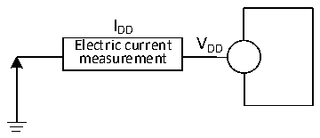
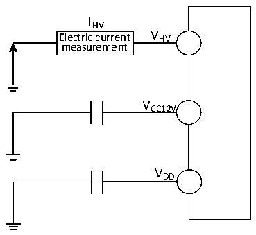
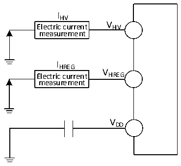
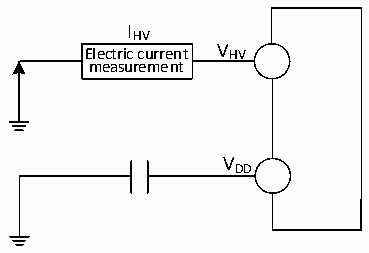

<!-- source-page: 32 -->

[← p.31](0031.md) · [index](../README.md) · [PDF p.32](https://ch32-riscv-ug.github.io/CH32V006/datasheet_zh/CH32V007DS0.PDF#page=32) · [p.33 →](0033.md)

<!-- header: CH32V007/M007数据手册 https://wch.cn -->

图3-2-1 CH32V007电流消耗测量  
 <!-- rendered from the PDF; verify at https://ch32-riscv-ug.github.io/CH32V006/datasheet_zh/CH32V007DS0.PDF#page=32 -->

🖼 Text parsed from the figure above

IDD  
Electric current V DD  
measurement  

图3-2-2 CH32M007K8U7和CH32M007G8R6电流消耗测量  
 <!-- rendered from the PDF; verify at https://ch32-riscv-ug.github.io/CH32V006/datasheet_zh/CH32V007DS0.PDF#page=32 -->

🖼 Text parsed from the figure above

IHV  
Electric current V HV  
measurement  
VCC12V  
VDD  

图3-2-3 CH32M007E8U7电流消耗测量  
 <!-- rendered from the PDF; verify at https://ch32-riscv-ug.github.io/CH32V006/datasheet_zh/CH32V007DS0.PDF#page=32 -->

🖼 Text parsed from the figure above

IHV  
Electric current V HV  
measurement  
IHREG  
V  
Electric current HREG  
measurement  
VDD  

图3-2-4 CH32M007E8R6电流消耗测量  
 <!-- rendered from the PDF; verify at https://ch32-riscv-ug.github.io/CH32V006/datasheet_zh/CH32V007DS0.PDF#page=32 -->

🖼 Text parsed from the figure above

IHV  
Electric current V HV  
measurement  
VDD  

CH32V007处于下列条件：  
常温 VDD= 3.3V 或 5V 情况下，测试时：所有 I/O 端口配置下拉输入，HSI = 24MHz（已校准），  
寄存器PWR_CTLR的位LDO_MODE = 10。使能或关闭所有外设时钟的功耗。  
<!-- image: p32-draw-image-00001 bbox=[502.8, 779.28, 522.24, 789.6] -->
<!-- footer: V1.8 27 -->
