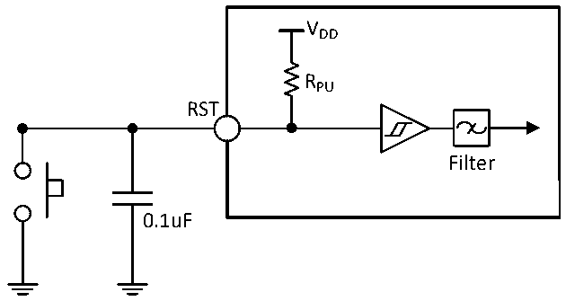

<!-- source-page: 37 -->

[← p.36](0036.md) · [index](../README.md) · [PDF p.37](https://ch32-riscv-ug.github.io/CH32V006/datasheet_zh/CH32V007DS0.PDF#page=37) · [p.38 →](0038.md)

<!-- header: CH32V007/M007数据手册 https://wch.cn -->

> ⬆ **Table continued** — rendered in full at [page 36](0036.md). <!-- p37-table-001 -->

输出驱动电流特性  
GPIO(通用输入/输出端口)可以吸收或输出多达±8mA电流，并且吸收或输出±20mA电流(不严格  
达到VOL/VOH)。在用户应用中，所有I/O引脚驱动总电流不能超过3.2节给出的绝对最大额定值。  

<!-- p37-table-002 (table-3-18@1) -->
<table><caption>表3-18 输出电压特性</caption><tr><th>符号</th><th>参数</th><th>条件</th><th>最小值</th><th>最大值</th><th>单位</th></tr><tr><td style="text-align:left">VOL</td><td>输出低电平，8个引脚吸收电流</td><td rowspan="2" style="text-align:left">TTL端口，I = +8mAIO 2.7V&lt; V &lt;5.5VDD</td><td></td><td>0.4</td><td rowspan="2">V</td></tr><tr><td style="text-align:left">VOH</td><td>输出高电平，8个引脚输出电流</td><td style="text-align:left">V -0.4DD</td><td></td></tr><tr><td style="text-align:left">VOL</td><td>输出低电平，8个引脚吸收电流</td><td rowspan="2" style="text-align:left">CMOS端口，I = +8mAIO 2.7V&lt; V &lt;5.5VDD</td><td></td><td>0.4</td><td rowspan="2">V</td></tr><tr><td style="text-align:left">VOH</td><td>输出高电平，8个引脚输出电流</td><td>2.3</td><td></td></tr><tr><td style="text-align:left">VOL</td><td>输出低电平，8个引脚吸收电流</td><td rowspan="2" style="text-align:left">I = +20mAIO 2.7V&lt; V &lt;5.5VDD</td><td></td><td>1.3</td><td rowspan="2">V</td></tr><tr><td style="text-align:left">VOH</td><td>输出高电平，8个引脚输出电流</td><td style="text-align:left">V -1.3DD</td><td></td></tr></table>

注：以上条件中如果多个I/O引脚同时驱动，电流总和不能超过表3.2节给出的绝对最大额定值。另  
外多个I/O引脚同时驱动时，电源/地线点上的电流很大，会导致压降使内部I/O的电压达不到表中电  
源电压，从而导致驱动电流小于标称值。  

<!-- p37-table-003 (table-3-19@1) -->
<table><caption>表3-19 输入输出交流特性</caption><tr><th>符号</th><th>参数</th><th>条件</th><th>最小值</th><th>最大值</th><th>单位</th></tr><tr><td style="text-align:left">F max(IO)out</td><td>最大频率</td><td style="text-align:left">CL = 50pF,V = 2.7-5.5VDD</td><td></td><td>30</td><td>MHz</td></tr><tr><td style="text-align:left">t f(IO)out</td><td>输出高至低电平的下降时间</td><td style="text-align:left">CL = 50pF,V = 2.7-5.5VDD</td><td></td><td>10</td><td>ns</td></tr><tr><td style="text-align:left">t r(IO)out</td><td>输出低至高电平的上升时间</td><td style="text-align:left">CL = 50pF,V = 2.7-5.5VDD</td><td></td><td>10</td><td>ns</td></tr><tr><td style="text-align:left">t EXTIpw</td><td>EXTI控制器检测到外部信号的脉冲宽度</td><td></td><td>10</td><td></td><td>ns</td></tr></table>

注：以上均为设计参数保证。  

### 3.3.10 RST引脚特性

电路参考设计及要求：  

图3-5 外部复位引脚典型电路  
 <!-- rendered from the PDF; verify at https://ch32-riscv-ug.github.io/CH32V006/datasheet_zh/CH32V007DS0.PDF#page=37 -->

🖼 Text parsed from the figure above

VDD  
RPU  
RST  
Filter  
0.1uF  

<!-- image: p37-draw-image-00001 bbox=[502.8, 779.28, 522.24, 789.6] -->
<!-- footer: V1.8 32 -->
