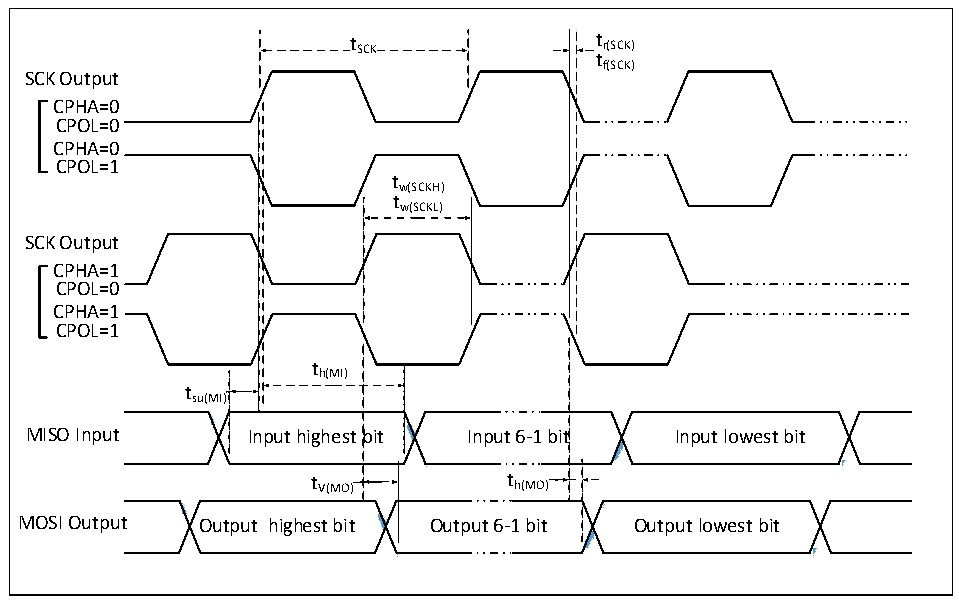
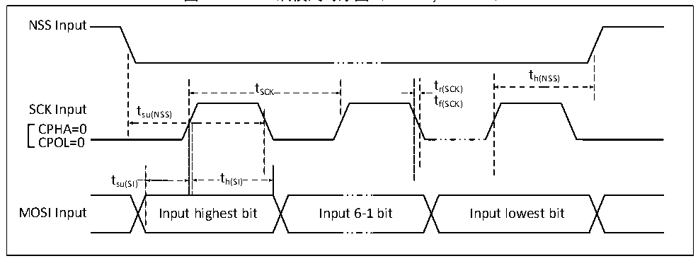

<!-- source-page: 39 -->

[← p.38](0038.md) · [index](../README.md) · [PDF p.39](https://ch32-riscv-ug.github.io/CH32V006/datasheet_zh/CH32V007DS0.PDF#page=39) · [p.40 →](0040.md)

<!-- header: CH32V007/M007数据手册 https://wch.cn -->

> ⬆ **Table continued** — rendered in full at [page 38](0038.md). <!-- p39-table-001 -->

### 3.3.13 SPI接口特性

图3-7 SPI主模式时序图  
 <!-- rendered from the PDF; verify at https://ch32-riscv-ug.github.io/CH32V006/datasheet_zh/CH32V007DS0.PDF#page=39 -->

🖼 Text parsed from the figure above

t SCK t r(SCK)  
tf(SCK)  
SCK Output  
CPHA=0  
CPOL=0  
CPHA=0  
CPOL=1  
tw(SCKH)  
tw(SCKL)  
SCK Output  
CPHA=1  
CPOL=0  
CPHA=1  
CPOL=1  
th(MI)  
tsu(MI)  
<!-- image: p39-draw-image-00002 inside the figure -->
<!-- image: p39-draw-image-00003 inside the figure -->
<!-- image: p39-draw-image-00004 inside the figure -->
<!-- image: p39-draw-image-00005 inside the figure -->
bit  t V(MO)  
)  
MISO Input Input highest bit Input 6-1 bit Input lowest bit  
t V(MO) t h(MO)  
<!-- image: p39-draw-image-00006 inside the figure -->
<!-- image: p39-draw-image-00007 inside the figure -->
<!-- image: p39-draw-image-00008 inside the figure -->
<!-- image: p39-draw-image-00009 inside the figure -->
MOSI Output Output highest bit Output 6-1 bit Output lowest bit  

图3-8-1 SPI从模式时序图（CPHA=0，CPOL=0）  
 <!-- rendered from the PDF; verify at https://ch32-riscv-ug.github.io/CH32V006/datasheet_zh/CH32V007DS0.PDF#page=39 -->

🖼 Text parsed from the figure above

NSS Input  
t  
t SCK t r(SCK) h(NSS)  
t  
SCK Input tsu(NSS) f(SCK)  
CPHA=0  
CPOL=0  
t h(SI)  th(SI)  
t su(SI) t h(SI)  
MOSI Input Input highest bit Input 6-1 bit Input lowest bit  

<!-- image: p39-draw-image-00001 bbox=[502.8, 779.28, 522.24, 789.6] -->
<!-- footer: V1.8 34 -->
