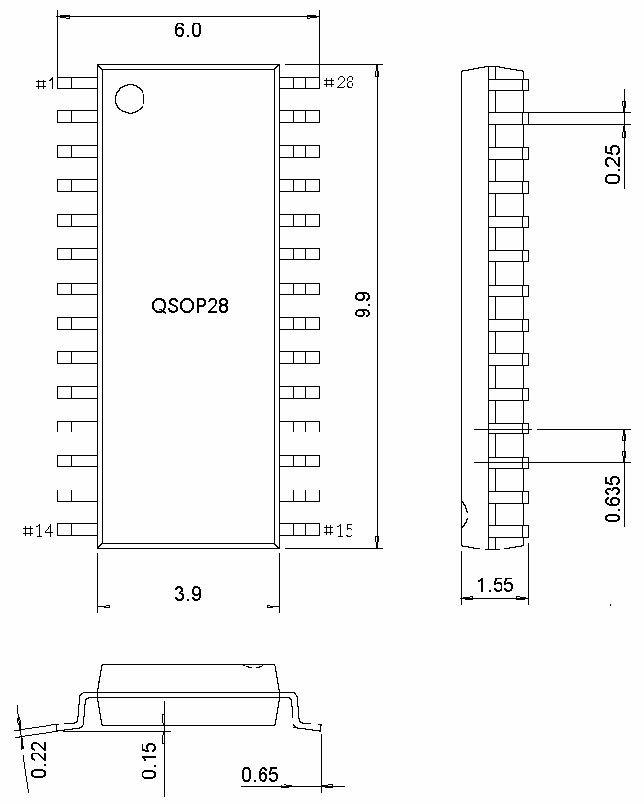

<!-- source-page: 49 -->

[← p.48](0048.md) · [index](../README.md) · [PDF p.49](https://ch32-riscv-ug.github.io/CH32V006/datasheet_zh/CH32V007DS0.PDF#page=49) · [p.50 →](0050.md)

<!-- header: CH32V007/M007数据手册 https://wch.cn -->

## 4.3 QSOP28封装

 <!-- p49-draw-image-00002 rendered from the PDF -->

## 4.4 QFN32封装

 <!-- p49-draw-image-00003 rendered from the PDF -->

<!-- image: p49-draw-image-00001 bbox=[502.8, 779.28, 522.24, 789.6] -->
<!-- footer: V1.8 44 -->
