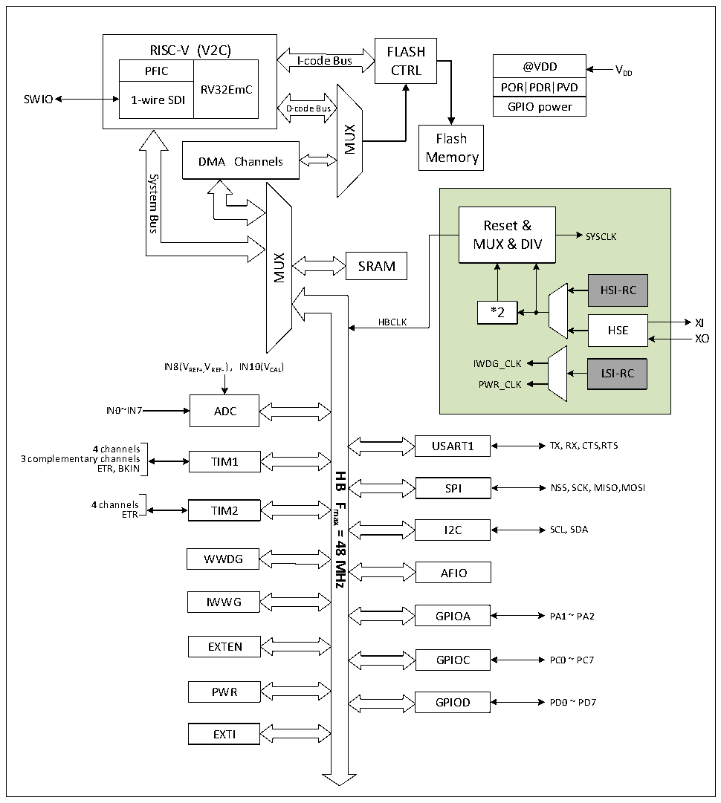

<!-- source-page: 3 -->

[← p.2](0002.md) · [index](../README.md) · [PDF p.3](https://ch32-riscv-ug.github.io/CH32V006/datasheet_en/CH32V00XRM.PDF#page=3) · [p.4 →](0004.md)

<!-- header: CH32V00X Reference Manual https://wch-ic.com -->

# Chapter 1 Memory and Bus Architecture

## 1.1 Bus Architecture

CH32V00X series products are designed based on RISC-V instruction set, and its architecture realizes the  
interaction of core, arbitration unit, DMA module, SRAM memory and other parts through multiple buses. The  
design integrates a general-purpose DMA controller to reduce the burden on the CPU and improve the access  
efficiency, while at the same time, it also has a data protection mechanism, automatic clock switching protection,  
and other measures to increase the stability of the system.  

Figure 1-1 CH32V002 system block diagram  
 <!-- rendered from the PDF; verify at https://ch32-riscv-ug.github.io/CH32V006/datasheet_en/CH32V00XRM.PDF#page=3 -->

🖼 Text parsed from the figure above

RISC-V (V2C)  PFIC  RV32EmC  1-wire SDI  
RISC-V (V2C) FLASH  
@VDD  POR PDR PVD  GPIO power  
I-code Bus  
PFIC CTRL  
SWIO  
D-code Bus  
MUX  
Flash  
Memory  
DMA Channels  
System  
Bus  
Reset &amp;  
SYSCLK  
MUX &amp; DIV  
MUX  
SRAM  
HSI-RC  
*2  
HBCLK XI  
HSE  
XO  
IN8(VREF+,VREF- )，IN10(VCAL) IWDG_CLK  
LSI-RC  
PWR_CLK  
IN0~IN7 ADC  
4 channels USART1 TX, RX, CTS,RTS  
3 complementary channels TIM1  
ETR, BKIN  
<strong>HB</strong>  
SPI NSS, SCK, MISO,MOSI  
4 channels TIM2  
<strong>Fmax</strong>  
ETR  
I2C  
SCL, SDA  
<strong>=</strong>  
<strong>48</strong>  
WWDG  
<strong>MHz</strong>  
AFIO  
IWWG  
GPIOA PA1 ~ PA2  
EXTEN  
GPIOC PC0 ~ PC7  
PWR  
GPIOD PD0 ~ PD7  
EXTI  

<!-- image: p3-draw-image-00001 bbox=[506.88, 783.6, 525.96, 793.8] -->
<!-- footer: V1.5 1 -->
