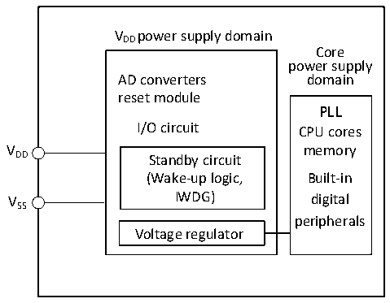

<!-- source-page: 16 -->

[← p.15](0015.md) · [index](../README.md) · [PDF p.16](https://ch32-riscv-ug.github.io/CH32V006/datasheet_en/CH32V00XRM.PDF#page=16) · [p.17 →](0017.md)

<!-- header: CH32V00X Reference Manual https://wch-ic.com -->

# Chapter 2 Power Control (PWR)

<strong><em>The module descriptions in this chapter apply to the full range of CH32V00X microcontrollers.</em></strong>  

## 2.1 Overview

For CH32V002, CH32V004, CH32V005, CH32V006, CH32V007, the operating voltage of the system ranges  
from 1.9V to 5.5V, and the built-in voltage regulator provides the working power required by the core. The power  
supply structure is shown in figure 2-1.  

Figure 2-1 Block diagram of power supply structure  
 <!-- rendered from the PDF; verify at https://ch32-riscv-ug.github.io/CH32V006/datasheet_en/CH32V00XRM.PDF#page=16 -->

🖼 Text parsed from the figure above

VDD power supply domain  
Core  
power supply  
AD converters domain  
reset module  
PLL  
I/O circuit CPU cores  
V memory  
DD Standby circuit  
(Wake-up logic, Built-in  
VSS IWDG) digital  
peripherals  
Voltage regulator  

For CH32M007:  
VHV: Supplies power to the internal high voltage regulator.  
VCC12V: Supplies power to the internal gate driver as well as the internal low voltage regulator.  
VDD: Supplies power to the I/O pins.  

## 2.2 Power Management

### 2.2.1 Power-on Reset and Power-down Reset

The power-on reset POR and power-off reset PDR circuits are integrated in the system. When the chip supply  
voltage VDD is lower than the corresponding threshold voltage, the system is reset by the relevant circuits, and  
there is no need for additional external reset circuits. For the parameters of power-on threshold voltage VPOR and  
power-off threshold voltage VPDR, please refer to the corresponding data manual.  
<!-- image: p16-draw-image-00001 bbox=[511.32, 783.6, 530.4, 793.8] -->
<!-- footer: V1.5 14 -->
