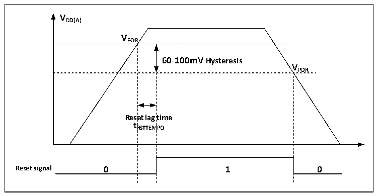
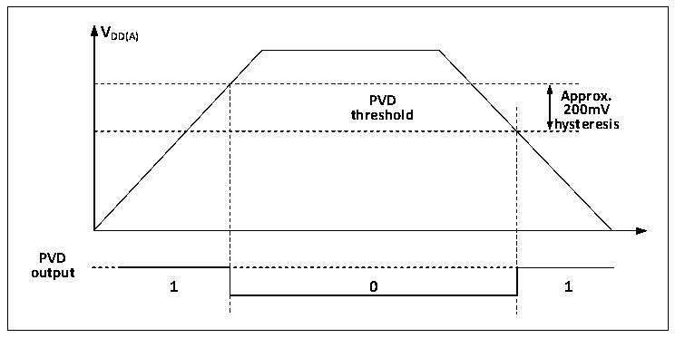

<!-- source-page: 17 -->

[← p.16](0016.md) · [index](../README.md) · [PDF p.17](https://ch32-riscv-ug.github.io/CH32V006/datasheet_en/CH32V00XRM.PDF#page=17) · [p.18 →](0018.md)

<!-- header: CH32V00X Reference Manual https://wch-ic.com -->

Figure 2-2 Schematic diagram of the operation of POR and PDR  
 <!-- rendered from the PDF; verify at https://ch32-riscv-ug.github.io/CH32V006/datasheet_en/CH32V00XRM.PDF#page=17 -->

🖼 Text parsed from the figure above

<strong>VDD(A)</strong>  
<strong>VPOR</strong>  
60-100mV Hysteresis  Rese t R  et lag RSTTEM  time MPO  V  
<strong>VPDR</strong>  
<strong>tRSTTEMPO</strong>  
<strong>Reset signal 0 1 0</strong>  

### 2.2.2 Programmable Voltage Detector

The programmable voltage monitor, PVD, is mainly used to monitor the change of the main power supply of the  
system and compare it with the threshold voltage set by PLS[1:0] of the power control register PWR_CTLR, and  
with the external interrupt register (EXTI) setting, it can generate relevant interrupts to notify the system in time  
for pre-power down operations such as data saving.  
The specific configuration is as follows.  
1) Set the PLS[1:0] field of the PWR_CTLR register to select the voltage threshold to be monitored.  
2) Optional interrupt handling. the PVD function internally connects to the rising/falling edge trigger setting of  
line 8 of the EXTI module, turns on this interrupt (Configures EXTI), and generates a PVD interrupt when  
VDD drops below the PVD threshold or rises above the PVD threshold.  
3) Set the PVDE bit of PWR_CTLR register to enable the PVD function.  
4) Read the PVD0 bit of PWR_CSR status register to obtain the current system main power and PLS[1:0]  
setting threshold relationship, and perform the corresponding soft processing. When the VDD voltage is  
higher than the threshold set by PLS[1:0], PVD0 position 0; when the VDD voltage is lower than the threshold  
set by PLS[1:0], PVD0 position 1.  

Figure 2-3 Schematic diagram of PVD operation  
 <!-- rendered from the PDF; verify at https://ch32-riscv-ug.github.io/CH32V006/datasheet_en/CH32V00XRM.PDF#page=17 -->

🖼 Text parsed from the figure above

<strong>VDD(A)</strong>  
PVD threshold  0  
<strong>hysteresis</strong>  
<strong>PVD</strong>  
<strong>output</strong>  

<em>Note: The function is apply for CH32V002, CH32V005, CH32V006, CH32V007, CH32M007 model chips.</em>  
<!-- image: p17-draw-image-00001 bbox=[511.32, 783.6, 530.4, 793.8] -->
<!-- footer: V1.5 15 -->
