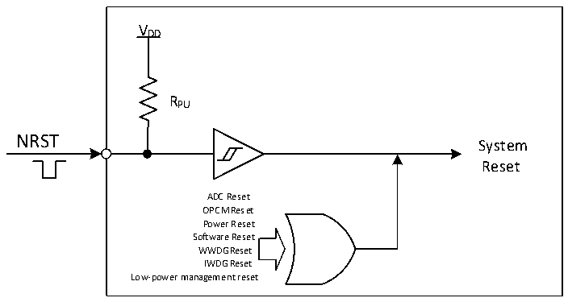

<!-- source-page: 24 -->

[← p.23](0023.md) · [index](../README.md) · [PDF p.24](https://ch32-riscv-ug.github.io/CH32V006/datasheet_en/CH32V00XRM.PDF#page=24) · [p.25 →](0025.md)

<!-- header: CH32V00X Reference Manual https://wch-ic.com -->
the user option byte. This will perform a system reset instead of entering standby mode after the process of  
entering standby mode is executed.  
ADC Reset: With ADC watchdog reset enable on, an ADC reset is generated when the ADC data is greater than  
the watchdog high threshold or less than the watchdog low threshold.  
OPCM Reset: With OPA Reset Enable and CMP Reset Enable turned on, an OPCM reset is generated when the  
OPA or CMP output goes high.  

Figure 3-1 System reset structure  
 <!-- rendered from the PDF; verify at https://ch32-riscv-ug.github.io/CH32V006/datasheet_en/CH32V00XRM.PDF#page=24 -->

🖼 Text parsed from the figure above

VDD  
RPU  
NRST  
System  
Reset  
ADC Reset  
OPCM Reset  
Power Reset  
Software Reset  
WWDG Reset  
IWDG Reset  
Low-power management reset  

<!-- image: p24-draw-image-00001 bbox=[511.32, 783.6, 530.4, 793.8] -->
<!-- footer: V1.5 22 -->
