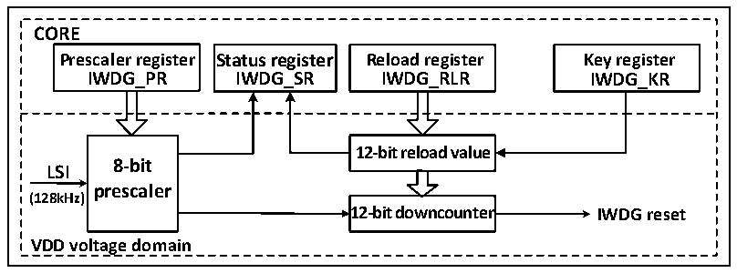

<!-- source-page: 43 -->

[← p.42](0042.md) · [index](../README.md) · [PDF p.43](https://ch32-riscv-ug.github.io/CH32V006/datasheet_en/CH32V00XRM.PDF#page=43) · [p.44 →](0044.md)

<!-- header: CH32V00X Reference Manual https://wch-ic.com -->

# Chapter 4 Independent Watchdog (IWDG)

<strong><em>The module described in this chapter is suitable for the full range of CH32V00X microcontrollers.</em></strong>  
The system is equipped with an independent watchdog (IWDG) to detect software failures caused by logic errors  
and external environment interference. The IWDG clock source comes from LSI and can be run independently of  
the main program, so it is suitable for situations with low precision requirements.  

## 4.1 Main Features

● 12-bit self-subtracting counter  
● Clock source LSI divider, can run in low-power mode  
● Reset condition: Counter value is reduced to 0  

## 4.2 Function Description

### 4.2.1 Principle and Application

Independent watchdog clock source LSI clock, its function can still work in standby mode. When the watchdog  
counter decrements itself to 0, a system reset will be generated, so the timeout is (Reload value + 1) clock.  

Figure 4-1 Block diagram of the structure of the independent watchdog  
 <!-- rendered from the PDF; verify at https://ch32-riscv-ug.github.io/CH32V006/datasheet_en/CH32V00XRM.PDF#page=43 -->

🖼 Text parsed from the figure above

<strong>CORE</strong>  
<strong>Prescaler register Status register Reload register Key register</strong>  
<strong>IWDG_PR IWDG_SR IWDG_RLR IWDG_KR</strong>  
<strong>12-bit reload value</strong>  
<strong>8-bit</strong>  
<strong>LSI</strong>  
<strong>prescaler</strong>  
<strong>(128kHz)</strong>  
<strong>12-bit downcounter IWDG reset</strong>  
<strong>VDD voltage domain</strong>  

● Enable independent watchdog  
After the system is reset, the watchdog is off, and the watchdog is turned on by writing 0xCCCC to the  
IWDG_CTLR register. After that, it can no longer be turned off unless a reset occurs.  
If the hardware independent watchdog enable bit (IWDG_SW) is turned on in the user option byte, the IWDG will  
be permanently turned on after the microcontroller resets.  
● Watchdog configuration  
Inside the watchdog is a 12-bit counter running progressively. When the value of the counter is reduced to 0, a  
system reset will occur. To enable the IWDG function, you need to perform the following actions:  
1) Counting time base: IWDG clock source LSI, through the IWDG_PSCR register to set the LSI frequency  
division value clock as the IWDG counting time base. Operation method: first write 0x5555 to the  
IWDG_CTLR register, and then modify the frequency division value in the IWDG_PSCR register. The PVU  
bit in the IWDG_STATR register indicates the update status of the frequency division value, and the  
frequency division value can only be modified and read out when the update is completed.  
<!-- image: p43-draw-image-00001 bbox=[511.32, 783.6, 530.4, 793.8] -->
<!-- footer: V1.5 41 -->
