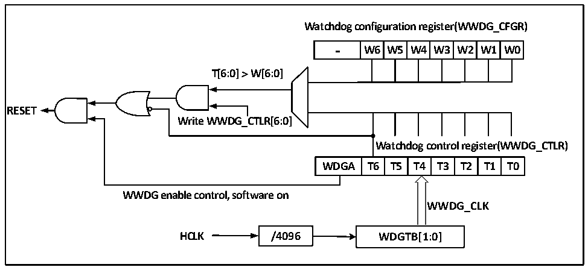

<!-- source-page: 47 -->

[← p.46](0046.md) · [index](../README.md) · [PDF p.47](https://ch32-riscv-ug.github.io/CH32V006/datasheet_en/CH32V00XRM.PDF#page=47) · [p.48 →](0048.md)

<!-- header: CH32V00X Reference Manual https://wch-ic.com -->

# Chapter 5 Window Watchdog (WWDG)

<strong><em>The module described in this chapter is suitable for the full range of CH32V00X microcontrollers.</em></strong>  
The window watchdog is generally used to monitor the software failures of the system, such as external  
interference, unforeseen logic errors and so on. It needs to refresh the counter (Feed the dog) within a specific  
window time (With upper and lower limits), otherwise the watchdog circuit will produce a system reset earlier or  
later than this window time.  

## 5.1 Main Features

● Programmable 7-bit self-subtractive counter  
● Double conditional reset: the current counter value is less than 0x40, or the counter value is reloaded outside  
the window time  
● Wake up advance notice function (EWI), used to feed the dog in time to prevent system reset  

## 5.2 Function Description

### 5.2.1 Principle and Application

The window watchdog runs based on a 7-bit decrement counter, which is mounted on the HB bus to count the  
frequency division of the time-based WWDG _ CLK source (HCLK/4096) clock, and the frequency division  
factor is set in the WDGTB [1:0] field in the configuration register WWDG_CFGR. The decrement counter is in a  
state of free operation, regardless of whether the watchdog function is turned on or not, the counter has been  
cyclically decreasing counting. As shown in figure 5-1, the internal structure block diagram of the window  
watchdog.  

Figure 5-1 Block diagram of Window Watchdog structure  
 <!-- rendered from the PDF; verify at https://ch32-riscv-ug.github.io/CH32V006/datasheet_en/CH32V00XRM.PDF#page=47 -->

🖼 Text parsed from the figure above

<strong>Watchdog configuration register(WWDG_CFGR)</strong>  
-  W6  W5  W4  W3  W2  W1  W0  
<strong>T[6:0] ＞ W[6:0]</strong>  
<strong>RESET</strong>  
<strong>Write WWDG_CTLR[6:0]</strong>  
<strong>Watchdog control register(WWDG_CTLR)</strong>  
WDGA  T6  T5  T4  T3  T2  T1  T0  
<strong>WWDG enable control, software on</strong>  
<strong>WWDG_CLK</strong>  
<strong>HCLK / 4 096 WDGTB[1:0]</strong>  

● Enable window watchdog  
After the system is reset, the watchdog is off, the WDGA bit of the WWDG_CTLR register is set to turn on the  
watchdog, and then it can no longer be turned off unless a reset occurs.  
<em>Note: You can turn off the clock source of the WWDG by setting the RCC_PB1PCENR register, pause the</em>  
<!-- image: p47-draw-image-00001 bbox=[511.32, 783.6, 530.4, 793.8] -->
<!-- footer: V1.5 45 -->
