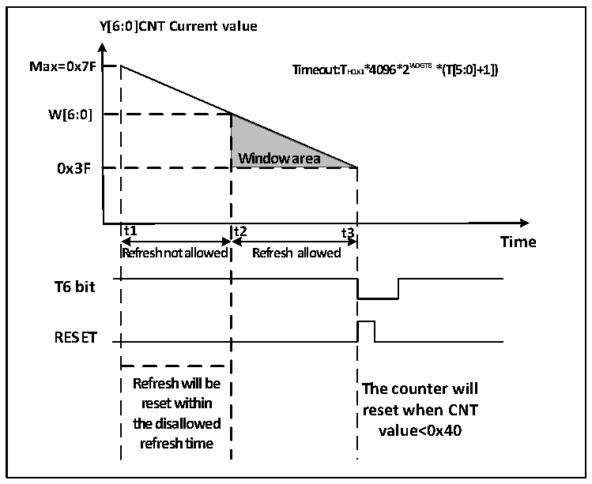

<!-- source-page: 48 -->

[← p.47](0047.md) · [index](../README.md) · [PDF p.48](https://ch32-riscv-ug.github.io/CH32V006/datasheet_en/CH32V00XRM.PDF#page=48) · [p.49 →](0049.md)

<!-- header: CH32V00X Reference Manual https://wch-ic.com -->
<em>WWDG_CLK count, stop the watchdog function indirectly, or reset the WWDG module by setting the</em>  
<em>RCC_PB1PRSTR register, which is equivalent to a reset.</em>  
● Watchdog configuration  
Inside the watchdog is a 7-bit counter running in a continuous cycle, which supports read and write access. To use  
the watchdog reset function, you need to perform the following actions:  
1) Count time base: through the WDGTB [1:0] bit field of the WWDG_CFGR register, be careful to turn on the  
WWDG module clock of the RCC unit.  
2) Window counter: sets the W [6:0] bit field of the WWDG_CFGR register. This counter is used by hardware  
to compare with the current counter. The value is configured by the user&#x27;s software and will not be changed.  
As the upper limit of the window time.  
3) Watchdog enable: WWDG_CTLR register WDGA bit software set 1, turn on watchdog function, you can  
reset the system.  
4) Feed the dog: that is, refresh the current counter value and configure the T [6:0] bit field of the  
WWDG_CTLR register. This action needs to be performed within the periodic window time after the  
watchdog function is turned on, otherwise the watchdog reset action will occur.  
● Feed the dog window time  
As shown in figure 5-2, the grey area is the monitoring window area of the window watchdog, and its upper limit  
time t2 corresponds to the time point at which the counter value reaches the window value W[6:0], and its lower  
limit time t3 corresponds to the time point at which the counter value reaches 0x3F. In this area, t2 &lt; t &lt; t3 can  
carry out dog feeding operation (write T[6:0]) to refresh the value of the current counter.  

Figure 5-2 Counting mode of Window Watchdog  
 <!-- rendered from the PDF; verify at https://ch32-riscv-ug.github.io/CH32V006/datasheet_en/CH32V00XRM.PDF#page=48 -->

🖼 Text parsed from the figure above

<strong>Y[6:0]CNT Current value</strong>  
<strong>Max=0x7F Timeout:THCLK1*4096*2W D G T B *(T[5:0]+1])</strong>  
<strong>W[6:0]</strong>  
<strong>Window area</strong>  
<strong>0x3F</strong>  
<strong>t1 t2 t3</strong>  
<strong>Time</strong>  
<strong>Refresh not allowed Refresh allowed</strong>  
<strong>T6 bit</strong>  
<strong>RESET</strong>  
<strong>Refresh will be</strong>  
<strong>The counter will</strong>  
<strong>reset within</strong>  
<strong>reset when CNT</strong>  
<strong>the disallowed</strong>  
<strong>value&lt;0x40</strong>  
<strong>refresh time</strong>  

● Watchdog reset  
1) When the dog is not fed in time, resulting in the value of the T[6:0] counter from 0x40 to 0x3F, a &quot;window  
<!-- image: p48-draw-image-00001 bbox=[511.32, 783.6, 530.4, 793.8] -->
<!-- footer: V1.5 46 -->
