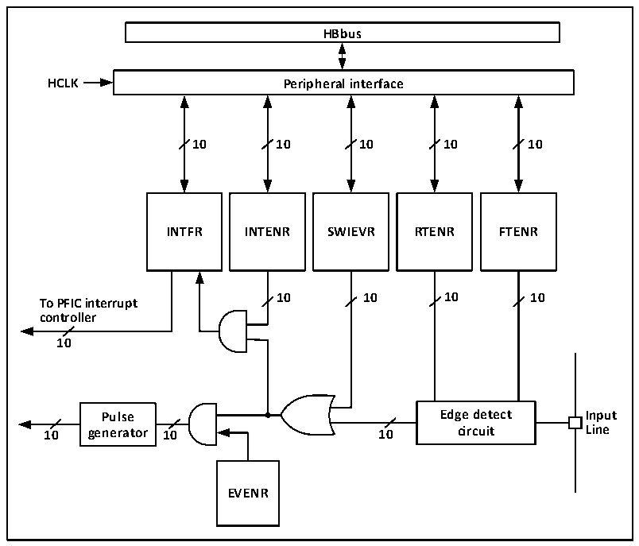

<!-- source-page: 53 -->

[← p.52](0052.md) · [index](../README.md) · [PDF p.53](https://ch32-riscv-ug.github.io/CH32V006/datasheet_en/CH32V00XRM.PDF#page=53) · [p.54 →](0054.md)

<!-- header: CH32V00X Reference Manual https://wch-ic.com -->

## 6.4 External Interrupt and Event Controller (EXTI)

### 6.4.1 Overview

Figure 6-1 External interrupt (EXTI) interface block diagram  
 <!-- rendered from the PDF; verify at https://ch32-riscv-ug.github.io/CH32V006/datasheet_en/CH32V00XRM.PDF#page=53 -->

🖼 Text parsed from the figure above

<strong>HBbus</strong>  
<strong>HCLK Peripheral interface</strong>  
<strong>10 10 10 10 10</strong>  
<strong>INTFR INTENR SWIEVR RTENR FTENR</strong>  
<strong>10 10 10 10</strong>  
<strong>To PFIC interrupt</strong>  
<strong>controller</strong>  
<strong>10</strong>  
<strong>Pulse Edge detect Input</strong>  
<strong>10 generator 10 10 circuit Line</strong>  
<strong>EVENR</strong>  

As can be seen from figure 6-1, the trigger source of the external interrupt can be either the software interrupt  
(SWIEVR) or the actual external interrupt channel, and the signal of the external interrupt channel will first be  
screened by the edge detection circuit. As long as one of the software interrupts or external interrupt signals is  
generated, it will be output to both event enabling and interrupt enabling circuits through the OR gate circuit in the  
diagram. As long as an interrupt is enabled or an event is enabled, an interrupt or event will occur. The six  
registers of EXTI are accessed by the processor through the HB interface.  

### 6.4.2 Wake-up Event

The system can wake up sleep patterns caused by WFE instructions through wake-up events. Wake-up events are  
generated through the following two configurations:  
● Enable an interrupt in the register of the peripheral, but not in the PFIC of the core, and enable the  
SEVONPEND bit in the core. Reflected in EXTI, it enables EXTI interrupts, but does not enable EXTI  
interrupts in PFIC, while enabling SEVONPEND bits. When CPU wakes up from WFE, the interrupt flag bit  
and PFIC hang bit of EXTI need to be cleared.  
● Enable an EXTI channel to be an event channel, and the CPU does not need to clear the interrupt flag bit and  
the PFIC hang bit after waking up from the WFE.  

### 6.4.3 Description

The use of external interrupt needs to configure the corresponding external interrupt channel, that is, select the  
<!-- image: p53-draw-image-00001 bbox=[511.32, 783.6, 530.4, 793.8] -->
<!-- footer: V1.5 51 -->
