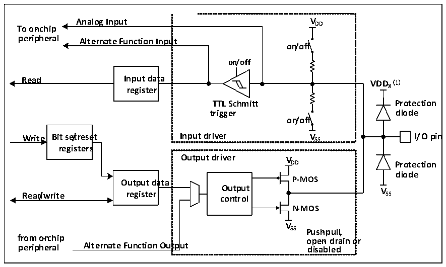

<!-- source-page: 73 -->

[← p.72](0072.md) · [index](../README.md) · [PDF p.73](https://ch32-riscv-ug.github.io/CH32V006/datasheet_en/CH32V00XRM.PDF#page=73) · [p.74 →](0074.md)

<!-- header: CH32V00X Reference Manual https://wch-ic.com -->

# Chapter 7 GPIO and Alternate Function (GPIO/AFIO)

<strong><em>The module described in this chapter is suitable for the full range of CH32V00X microcontrollers.</em></strong>  
The GPIO port can be configured in a variety of input or output modes, with built-in pull-up or pull-down  
resistors that can be closed, and can be configured for push-pull or open-drain functions. The GPIO port can also  
be reused into other functions.  

## 7.1 Main Features

Each pin of the port can be configured to one of the following multiple modes  
● Floating input ● Open-drain output  
● Pull-up input ● Push-pull output  
● Pull-down input ● Inputs and outputs of alternate functions  
● Analog input  
Many pins have the alternate function, and many other peripherals map their output and input channels to these  
pins. The specific usage of these alternate pins needs to refer to each peripheral. Whether these pins are reused and  
remapped is explained in this chapter.  

## 7.2 Function Description

### 7.2.1 Overview

Figure 7-1 GPIO module basic structure block diagram  
 <!-- rendered from the PDF; verify at https://ch32-riscv-ug.github.io/CH32V006/datasheet_en/CH32V00XRM.PDF#page=73 -->

🖼 Text parsed from the figure above

<strong>Analog Input VDD</strong>  
<strong>To on-chip</strong>  
<strong>peripheral Alternate Function Input</strong>  
<strong>on/off</strong>  
<strong>on/off</strong>  
<strong>Read Input data</strong>  
<strong>VDD (1)</strong>  
<strong>register X</strong>  
<strong>TTL Schmitt Protection</strong>  
<strong>trigger diode</strong>  
<strong>on/off</strong>  
<strong>Write Bit se/treset Input driver V SS I/O pin</strong>  
<strong>registers</strong>  
<strong>Output driver V</strong>  
<strong>DD Protection</strong>  
<strong>diode</strong>  
<strong>Output data P-MOS</strong>  
<strong>Read/write register c O o u n t t p r u ol t V SS</strong>  
<strong>N-MOS</strong>  
<strong>V</strong>  
<strong>SS Push-pull,</strong>  
<strong>from o-nchip open- drain or</strong>  
<strong>peripheral Alternate Function Output disabled</strong>  

<em>Note: (1) VDDx is VDD when GPIO is normal IO, and VDDx is VDD_FT when GPIO is FTIO.</em>  
As shown in figure 7-1, the IO port structure, each pin has two protection diodes inside the chip, and the IO port  
can be divided into input and output drive modules. The input driver has a weak pull-up resistor, which can be  
<!-- image: p73-draw-image-00001 bbox=[511.32, 783.6, 530.4, 793.8] -->
<!-- footer: V1.5 71 -->
