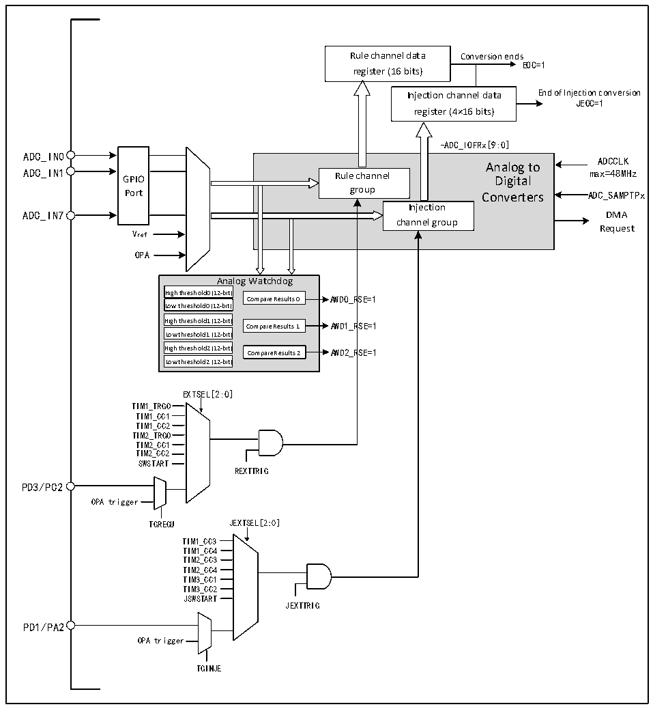

<!-- source-page: 101 -->

[← p.100](0100.md) · [index](../README.md) · [PDF p.101](https://ch32-riscv-ug.github.io/CH32V006/datasheet_en/CH32V00XRM.PDF#page=101) · [p.102 →](0102.md)

<!-- header: CH32V00X Reference Manual https://wch-ic.com -->

## 9.2 Functional Description

### 9.2.1 Module Structure

Figure 9-1 ADC module block diagram  
 <!-- rendered from the PDF; verify at https://ch32-riscv-ug.github.io/CH32V006/datasheet_en/CH32V00XRM.PDF#page=101 -->

🖼 Text parsed from the figure above

Rule channel data Conversion ends  
EOC=1  
register (16 bits)  
Injection channel data End of Injection conversion  
JEOC=1  
register (4×16 bits)  
-ADC_IOFRx[:9:0]  
ADC_IN0  
GPIOPort  
Analog to Rule channel Digital group Converters Injection channel group  
ADCCLK  
ADC_IN7 DMA  
Request  
Vref  
OPA  
Analog Watchdog  
High threshold0 (1A2-nbita)  Low threshold0 (12-bit)  High threshold1 (12-bit)  Low threshold1 (12-bit)  High threshold2 (12-bit)  Low threshold2 (12-bit)  
Compare Results 0 AWD0_RSE=1  
High threshold1 (12-bit) Compare Results 1 AWD1_RSE=1  
High threshold2 (12-bit) Compare Results 2 AWD2_RSE=1  
EXTSEL[2:0]  
TIM1_TRGO  
TIM1_CC1  
TIM1_CC2  
TIM2_TRGO  
TIM2_CC1  
TIM2_CC2  
SWSTART  
REXTTRIG  
PD3/PC2  
OPA trigger  
TGREGU JEXTSEL[2:0]  
TIM1_CC3  
TIM1_CC4  
TIM2_CC3  
TIM2_CC4  
TIM3_CC1  
TIM3_CC2  
JSWSTART  
JEXTTRIG  
PD1/PA2  
OPA trigger  
TGINJE  

### 9.2.2 ADC Configuration

1) Module power-up  
An ADON bit of 1 in the ADC_CTLR2 register indicates that the ADC module is powered up. When the ADC  
module enters the power-up state (ADON=1) from the power-off mode (ADON=0), it needs to be delayed for a  
period of time for t to stabilize the module. After that, the ADON bit is written again as 1, which is used as the  
STAB  
startup signal for the software to start the ADC conversion. By clearing the ADON bit to 0, you can terminate the  
<!-- image: p101-draw-image-00001 bbox=[511.32, 783.6, 530.4, 793.8] -->
<!-- footer: V1.5 95 -->
