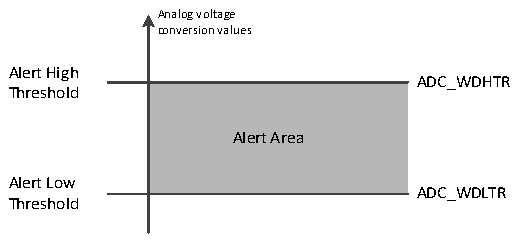

<!-- source-page: 107 -->

[← p.106](0106.md) · [index](../README.md) · [PDF p.107](https://ch32-riscv-ug.github.io/CH32V006/datasheet_en/CH32V00XRM.PDF#page=107) · [p.108 →](0108.md)

<!-- header: CH32V00X Reference Manual https://wch-ic.com -->
If an injection channel is converted, the conversion data is stored in the ADC_IDATARx register, the injection  
conversion end flag JEOC is set, and if JEOCIE is set, an interrupt is generated.  

### 9.2.5 Analog Watchdog

If the analog voltage converted by the ADC is lower than the low threshold or higher than the high threshold, the  
AWD analog watchdog status bit is set. The threshold setting is located in the lowest 12 significant bits of the  
ADC_WDHTR and ADC_WDLTR registers. The corresponding interrupt is allowed by setting the AWDIE bit of  
the ADC_CTLR1 register.  

Figure 9-2 Analog watchdog threshold area  
 <!-- rendered from the PDF; verify at https://ch32-riscv-ug.github.io/CH32V006/datasheet_en/CH32V00XRM.PDF#page=107 -->

🖼 Text parsed from the figure above

Analog voltage  
conversion values  
Alert High  
ADC_WDHTR  
<!-- image: p107-draw-image-00002 inside the figure -->
Threshold  
Alert Area  
Alert Low  
ADC_WDLTR  
Threshold  

Configure the AWDSGL, AWDEN, JAWDEN and AWDCH[4:0] bits of the ADC_CTLR1 register to select the  
channel for analog watchdog alerting, as related in the following table.  

<!-- p107-table-001 (table-9-6@1) -->
<table><caption>Table 9-6 Analog Watchdog channel selection</caption><tr><th rowspan="2" style="text-align:left">Analog watchdog alert channel</th><th colspan="4">ADC_CTLR1 register control bit</th></tr><tr><td>AWDSGL</td><td>AWDEN</td><td>JAWDEN</td><td>AWDCH[4:0]</td></tr><tr><td>No vigilance</td><td>Ignore</td><td>0</td><td>0</td><td>Ignore</td></tr><tr><td>All injection channels</td><td>0</td><td>0</td><td>1</td><td>Ignore</td></tr><tr><td>All rule channels</td><td>0</td><td>1</td><td>0</td><td>Ignore</td></tr><tr><td style="text-align:left">All injection and rule channels</td><td>0</td><td>1</td><td>1</td><td>Ignore</td></tr><tr><td>Single injection channel</td><td>1</td><td>0</td><td>1</td><td style="text-align:left">Determine the channel number</td></tr><tr><td>Single rule channel</td><td>1</td><td>1</td><td>0</td><td style="text-align:left">Determine the channel number</td></tr><tr><td style="text-align:left">Single injection and rule channel</td><td>1</td><td>1</td><td>1</td><td style="text-align:left">Determine the channel number</td></tr></table>

## 9.3 Register Description

<!-- p107-table-002 (table-9-7@1) pages 107-108 -->
<table><caption>Table 9-7 ADC-related registers list</caption><tr><th>Name</th><th>Access address</th><th>Description</th><th>Reset value</th></tr><tr><td>R32_ADC_STATR</td><td>0x40012400</td><td>ADC Status Register</td><td>0xXXXXXXX0</td></tr><tr><td>R32_ADC_CTLR1</td><td>0x40012404</td><td>ADC Control Register 1</td><td>0x00000000</td></tr><tr><td>R32_ADC_CTLR2</td><td>0x40012408</td><td>ADC Control Register 2</td><td>0x00000000</td></tr><tr><td>R32_ADC_SAMPTR2</td><td>0x40012410</td><td>ADC Sample Time Configuration Register 2</td><td>0x00000000</td></tr><tr><td>R32_ADC_IOFR1</td><td>0x40012414</td><td style="text-align:left">ADC Injection Channel Data Offset Register 1</td><td>0x00000000</td></tr><tr><td>R32_ADC_IOFR2</td><td>0x40012418</td><td style="text-align:left">ADC Injection Channel Data Offset Register 2</td><td>0x00000000</td></tr><tr><td>R32_ADC_IOFR3</td><td>0x4001241C</td><td style="text-align:left">ADC Injection Channel Data Offset Register 3</td><td>0x00000000</td></tr><tr><td>R32_ADC_IOFR4</td><td>0x40012420</td><td style="text-align:left">ADC Injection Channel Data Offset Register 4</td><td>0x00000000</td></tr><tr><td>R32_ADC_WDHTR</td><td>0x40012424</td><td>ADC Watchdog High Threshold Register</td><td>0x00000FFF</td></tr><tr><td>R32_ADC_WDLTR</td><td>0x40012428</td><td>ADC Watchdog Low Threshold Register</td><td>0x00000000</td></tr><tr><td>R32_ADC_RSQR1</td><td>0x4001242C</td><td>ADC Rule Sequence Register 1</td><td>0x00000000</td></tr><tr><td>R32_ADC_RSQR2</td><td>0x40012430</td><td>ADC Rule Sequence Register 2</td><td>0x00000000</td></tr><tr><td>R32_ADC_RSQR3</td><td>0x40012434</td><td>ADC Rule Sequence Register 3</td><td>0x00000000</td></tr><tr><td>R32_ADC_ISQR</td><td>0x40012438</td><td>ADC Injection Sequence Register</td><td>0x00000000</td></tr><tr><td>R32_ADC_IDATAR1</td><td>0x4001243C</td><td>ADC Injection Data Register 1</td><td>0x00000000</td></tr><tr><td>R32_ADC_IDATAR2</td><td>0x40012440</td><td>ADC Injection Data Register 2</td><td>0x00000000</td></tr><tr><td>R32_ADC_IDATAR3</td><td>0x40012444</td><td>ADC Injection Data Register 3</td><td>0x00000000</td></tr><tr><td>R32_ADC_IDATAR4</td><td>0x40012448</td><td>ADC Injection Data Register 4</td><td>0x00000000</td></tr><tr><td>R32_ADC_RDATAR</td><td>0x4001244C</td><td>ADC Rule Data Register</td><td>0x00000000</td></tr><tr><td>R32_ADC_CTLR3</td><td>0x40012450</td><td>ADC Control Register 3</td><td>0x00000001</td></tr><tr><td>R32_ADC_WDTR1</td><td>0x40012454</td><td>ADC Watchdog 1 Threshold Register</td><td>0x0FFF0000</td></tr><tr><td>R32_ADC_WDTR2</td><td>0x40012458</td><td>ADC Watchdog 2 Threshold Register</td><td>0x0FFF0000</td></tr></table>

<!-- image: p107-draw-image-00001 bbox=[515.88, 783.6, 534.96, 793.8] -->
<!-- footer: V1.5 101 -->
