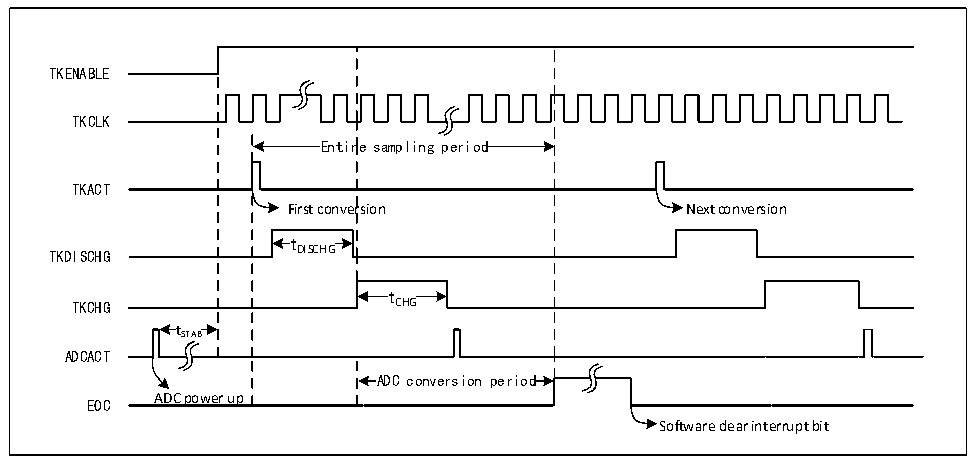

<!-- source-page: 120 -->

[← p.119](0119.md) · [index](../README.md) · [PDF p.120](https://ch32-riscv-ug.github.io/CH32V006/datasheet_en/CH32V00XRM.PDF#page=120) · [p.121 →](0121.md)

<!-- header: CH32V00X Reference Manual https://wch-ic.com -->

# Chapter 10 Touch Key Detection (TKEY)

<strong><em>This chapter applies to the CH32V006, CH32V007, CH32M007.</em></strong>  
The touch detection control (TKEY) unit, with the help of the voltage conversion function of the ADC module,  
realizes the touch key detection function by converting the capacitance to the voltage for sampling. The detection  
channel reuses the 8 external channels of ADC, and the touch key detection is realized through the single  
conversion mode of the ADC module.  

## 10.1 Functional Description

● Enable TKEY  
The TKEY detection process needs the cooperation of the ADC module, so when using the TKEY function, it is  
necessary to ensure that the ADC module is in the power-on state (ADON=1), and then turn on the TKEY unit  
function by changing the TKENABLE position 1 of the ADC_CTLR1 register, and the charging current of the  
TKEY module can be adjusted through the TKITUNE bit.  
TKEY only supports single channel conversion mode. Configure the channel to be converted to the first rule  
group sequence of the ADC module, and the software starts the conversion (Write R32_TKEY_DISCHG register).  
<em>Note: When the TKEY conversion is disabled, ADC channel configuration function can still be retained.</em>  

Figure 10-1 TKEY working timing diagram  
 <!-- rendered from the PDF; verify at https://ch32-riscv-ug.github.io/CH32V006/datasheet_en/CH32V00XRM.PDF#page=120 -->

🖼 Text parsed from the figure above

TKENABLE  
TKCLK  
Entir  re sampling period  Entir  re sampling period  
TKACT  
First conversion Next conversion  
t DISCHG  tDISCHG  
TKDISCHG DISCHG  
t CHG  tCHG  
TKCHG CHG  
t  tSTAB  
ADCACT  
ADC conversion period  ADC conversion period  
EOC ADC power up  
Software clear interrupt bit  

● Programmable sampling time  
TKEY unit conversion needs to use several HBCLK clock cycles (tDISCHG) for discharge, and then charge and  
sample the voltage of the channel through several HBCLK cycles (tCHG). The number of discharge cycles is  
configured by register R32_TKEY_DISCHG, the number of charging cycles is configured by register  
R32_TKEY_CHG, and all channels use the same number of charge and discharge cycles.  

## 10.2 TKEY Operations

TKEY detection is an extended function of ADC module. Its working principle is to change the capacitance  
<!-- image: p120-draw-image-00001 bbox=[515.88, 783.6, 534.96, 793.8] -->
<!-- footer: V1.5 114 -->
