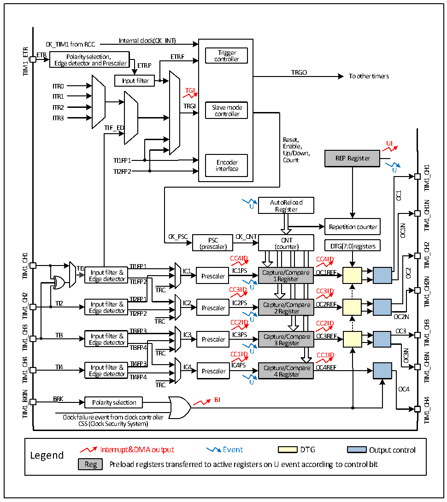

<!-- source-page: 124 -->

[← p.123](0123.md) · [index](../README.md) · [PDF p.124](https://ch32-riscv-ug.github.io/CH32V006/datasheet_en/CH32V00XRM.PDF#page=124) · [p.125 →](0125.md)

<!-- header: CH32V00X Reference Manual https://wch-ic.com -->
counts the number of times ATRLR reloads initial values for CNT, which can generate specific events when the  
number of times reaches the number of times set in the repeated count register (RPTCR).  
The advanced-control timer has four sets of comparison capture channels, each of which can input pulses from its  
own pin or output waveform to the pin, that is, the compare/capture channel supports input and output modes. The  
input of each channel of the compare/capture register supports operations such as filtering, frequency division and  
edge detection, supports mutual trigger between channels, and provides a clock for the core counter CNT. Each  
comparison acquisition channel has a set of comparison acquisition registers (CHxCVR) that support comparison  
with the master counter (CNT) to output pulses.  

Figure 11-1 Block diagram of advanced-control timer structure  
 <!-- rendered from the PDF; verify at https://ch32-riscv-ug.github.io/CH32V006/datasheet_en/CH32V00XRM.PDF#page=124 -->

🖼 Text parsed from the figure above

Internal clock(CK_INT)  
CK_TIM1 from RCC  
TIM1_ETR  
ETR Polarity selection, ETRF co T n ri t g r g o e lle r r  
Polarity selection, Edge detector and Prescaler  r  
TRGO  
To other timers  
Input filter  
ITR0  
TGI  
ITR1  
ITR2 TRGI Slave mode  
controller  
ITR3  
TIF_ED  
Reset,  
Enable, UI  
Up/Down,  
TI1FP1 Encoder Count REP Register  
TIM1_CH1  
TI2FP2 interface U  
OC1  
AutoReload  
TIM1_CH1N  
U Register  
OC1N  
Repetition counter  
CK_PSC CK_CNT  
PSC CNT  
TIM1_CH2  
(prescaler) (counter) DTG[7:0]registers  
TIM1_CH1  
CC4ID CC4ID  
TI1 Input filter &amp; TTII11FFPP11 IC1 IICC11PPSS Capture/Compare OC1REF  
OC2  
Edge detector Prescaler 1 Register TI1FP2  
TIM1_CH2N  
TRC CC3ID U CC3ID  
TIM1_CH2  
TI2FP1  
TI2 Input filter &amp; IC2 IC2PS Capture/Compare OC2REF  
Prescaler  
Edge detector TI2FP2 2 Register TRC CC2IDU CC2ID  
OC2N  
TIM1_CH3  
TIM1_CH3  
TI3FP3  
OC3  
TI3 Input filter &amp; IC3 Prescaler IC3PS Capture/Compare OC3REF  
Edge detector 3 Register  
TI3FP4  
OC3N  
TRC CC1ID U CC1ID  
TIM1_CH3N  
TIM1_CH4  
TI4 Input filter &amp; TI4FP3 IC4 IC4PS Capture/Compare OC4REF  
Edge detector Prescaler 4 Register  
TI4FP4  
TRC U  
OC4  
TIM1_BKIN  
BRK BI  
TIM1_CH4  
Polarity selection  
Clock failure event from clock controller  
CSS (Clock Security System)  
Interrupt&amp;DMA output Event DTG Output control  
Legend  
Reg Preload registers transferred to active registers on U event according to control bit  

<!-- image: p124-draw-image-00001 bbox=[515.88, 783.6, 534.96, 793.8] -->
<!-- footer: V1.5 118 -->
