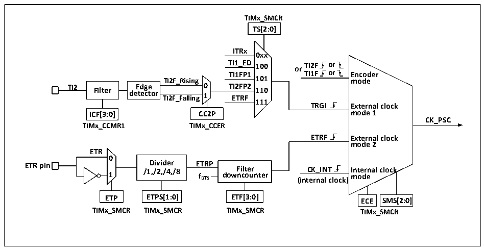

<!-- source-page: 125 -->

[← p.124](0124.md) · [index](../README.md) · [PDF p.125](https://ch32-riscv-ug.github.io/CH32V006/datasheet_en/CH32V00XRM.PDF#page=125) · [p.126 →](0126.md)

<!-- header: CH32V00X Reference Manual https://wch-ic.com -->

### 11.2.2 Clock Input

Figure 11-2 Block diagram of CK_PSC source for advanced-control timer  
 <!-- rendered from the PDF; verify at https://ch32-riscv-ug.github.io/CH32V006/datasheet_en/CH32V00XRM.PDF#page=125 -->

🖼 Text parsed from the figure above

<strong>TIMx_SMCR</strong>  
<strong>TS[2:0]</strong>  
<strong>ITRx</strong>  
<strong>0xx</strong>  
<strong>TI1_ED 100 or TI2F or</strong>  
<strong>TI1FP1 TI1F or Encoder</strong>  
<strong>TI2F_Rising 101 mode</strong>  
<strong>TI2 Filter de E t d e g c e tor TI2F_Falling 0 1 T E I2 T F R P F 2 110</strong>  
<strong>111</strong>  
<strong>TRGI External clock</strong>  
<strong>ICF[3:0] CC2P mode 1</strong>  
<strong>CK_PSC</strong>  
<strong>TIMx_CCMR1 TIMx_CCER</strong>  
<strong>ETRF External clock</strong>  
<strong>mode 2</strong>  
<strong>ETR</strong>  
<strong>0</strong>  
<strong>ETR pin 1 /1 D ,/ i 2 vi , d /4 e , r /8 E f T D R TS P dow F n i c lt o e u r nter (int C e K r _ n I a N l T clock) I m n o te d r e nal clock</strong>  
<strong>ETP ETPS[1:0] ETF[3:0] ECE SMS[2:0]</strong>  
<strong>TIMx_SMCR TIMx_SMCR TIMx_SMCR TIMx_SMCR</strong>  

Advanced-control timer CK_PSC has many clock sources and can be divided into four categories:  
1) The external clock pin (ETR) inputs the route of the clock: ETR→ETRP→ETRF;  
2) Internal HB clock input route: CK_INT;  
3) Route from the comparison capture channel pin (TIM1_CHx): TIM1_CHx→TIx→TIxFPx, this route is also  
used in encoder mode;  
4) Input from other internal timers: ITRx;  
By determining the input pulse selection of the SMS from which the CK_PSC comes from, the actual operation  
can be divided into four categories:  
1) Select internal clock source (CK_INT);  
2) External clock source mode 1;  
3) External clock source mode 2;  
4) Encoder mode;  
All 4 clock sources mentioned above can be selected by these four operations.  

#### 11.2.2.1 Internal clock source (CK_INT)

If the advanced timer is started when the SMS domain is kept at 000b, then the internal clock source (CK_INT) is  
selected as the clock. At this point, CK_INT is CK_PSC.  

#### 11.2.2.2 External Clock Source Mode 1

If the SMS domain is set to 111b, external clock source mode 1 is enabled. When the external clock source 1 is  
enabled, TRGI is selected as the source of CK_PSC, and it is worth noting that you also need to configure the TS  
domain to select the source of TRGI. The following pulses can be selected as clock sources in the TS domain:  
1) Internal trigger (ITRx, x=0, 1, 2, 3)  
2) The signal after compare/capture channel 1 through the edge detector (TI1F_ED).  
3) The signal TI1FP1, TI2FP2 of the compare/capture channel.  
<!-- image: p125-draw-image-00001 bbox=[515.88, 783.6, 534.96, 793.8] -->
<!-- footer: V1.5 119 -->
