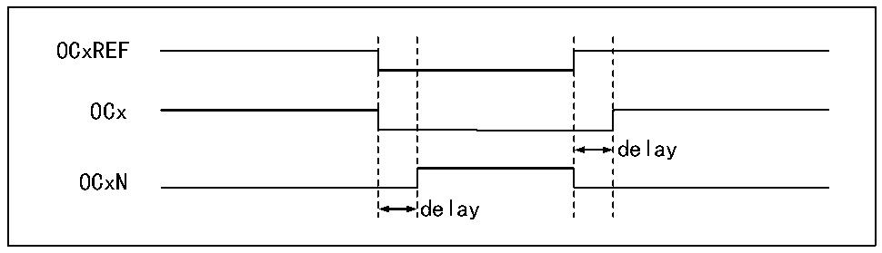

<!-- source-page: 130 -->

[← p.129](0129.md) · [index](../README.md) · [PDF p.130](https://ch32-riscv-ug.github.io/CH32V006/datasheet_en/CH32V00XRM.PDF#page=130) · [p.131 →](0131.md)

<!-- header: CH32V00X Reference Manual https://wch-ic.com -->
Set 110b or 111b in the OCxM field to use PWM mode 1 or mode 2, set the OCxPE bit to enable the preload  
register, and finally set the ARPE bit to enable automatic reload of the preload register. Since the value of the  
preload register can only be sent to the shadow register when an update event occurs, the UG bit needs to be set to  
initialize all registers before the core counter starts counting. In PWM mode, the core counter and the compare  
capture register are always comparing, and depending on the CMS bit, the timer is able to output edge-aligned or  
center-aligned PWM signals.  
● Edge alignment  
When edge alignment is used, the core counter is incremented or decremented, and in the PWM mode 1 scenario,  
OCxREF is high when the core counter value is greater than the compare capture register, and low when the core  
counter value is less than the compare capture register (e.g., when the core counter grows to the value of  
R16_TIMx_ATRLR and reverts to all zeros).  
● Central alignment  
When using the central alignment modes, the core counter runs in alternating incremental and decremental count  
modes, and OCxREF makes rising and falling jumps when the values of the core counter and the compare capture  
register match. However, the comparison flags are set at different times in the three central alignment modes.  
When using the central alignment modes, it is best to generate a software update flag (Set the UG bit) before  
starting the core counter.  

### 11.3.6 Complementary Output and Dead-time Insertion

The compare/capture channel generally has two output pins (Compare/capture channel 4 has only one output pin)  
and can output two complementary signals (OCx and OCxN). OCx and OCxN can be independently set for  
polarity via the CCxP and CCxNP bits, independently set for output enable via CCxE and CCxNE, and  
independently set for output enable via the MOE, OIS, OISN, OSSI, and OSSR bits for dead-time and other  
controls. Enabling the OCx and OCxN outputs simultaneously will insert a dead-time, and each channel has a  
10-bit dead-time generator. OCx and OCxN are generated by the OCxREF association. If both OCx and OCxN  
are high active, then OCx is the same as OCxREF except that the rising edge of OCx is equivalent to OCxREF  
with a delay, and OCxN is the opposite of OCxREF in that its rising edge will have a delay relative to the falling  
edge of the reference signal. If the delay is greater than the effective output width, the corresponding pulse will  
not be generated.  
The relationship between OCx and OCxN and OCxREF is illustrated in Figure 10-4, which shows the dead-time.  

Figure 11-4 Complementary outputs and dead-time  
 <!-- rendered from the PDF; verify at https://ch32-riscv-ug.github.io/CH32V006/datasheet_en/CH32V00XRM.PDF#page=130 -->

🖼 Text parsed from the figure above

OCxREF  
OCx  
delay  
OCxN  
delay  

### 11.3.7 Brake Signal

When the brake signal is generated, the output enable signal and invalid level are modified according to the MOE,  
OIS, OISN, OSSI, and OSSR bits. However, OCx and OCxN will not be at the active level at any time. The  
<!-- image: p130-draw-image-00001 bbox=[515.88, 783.6, 534.96, 793.8] -->
<!-- footer: V1.5 124 -->
