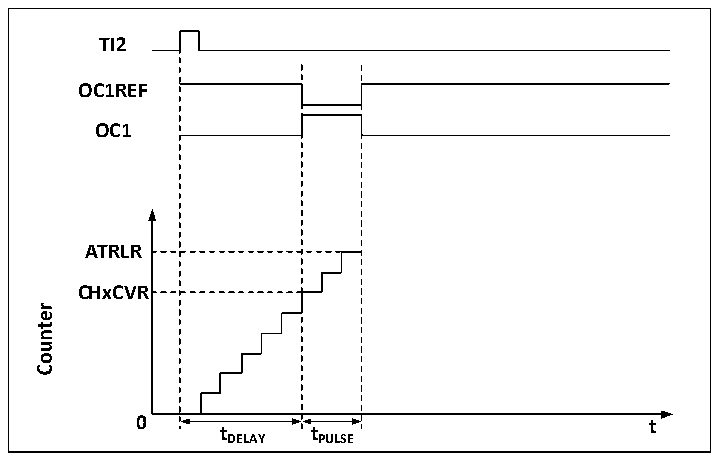

<!-- source-page: 131 -->

[← p.130](0130.md) · [index](../README.md) · [PDF p.131](https://ch32-riscv-ug.github.io/CH32V006/datasheet_en/CH32V00XRM.PDF#page=131) · [p.132 →](0132.md)

<!-- header: CH32V00X Reference Manual https://wch-ic.com -->
source of the brake event can come from the brake input pin or it can be a clock failure event which is generated  
by the CSS (Clock Safety System).  
After system reset, the brake function is disabled by default (MOE bit is low), and setting the BKE bit enables the  
brake function. The polarity of the input brake signal can be set by setting BKP, and the BKE and BKP signals can  
be written at the same time, and there is a delay of one HB clock before the actual writing, so you need to wait for  
one HB cycle to read the written value correctly.  
At the presence of the selected level on the brake pin the system will generate the following actions.  
1) The MOE bit is cleared asynchronously, setting the output to an invalid, idle or reset state, depending on the  
setting of the SOOI bit.  
2) After the MOE has been cleared, each output channel outputs a level determined by OISx.  
3) When using complementary outputs: the outputs are placed in a null state, depending on the polarity.  
4) If the BIE is set, an interrupt is generated when the BIF is set; if the BDE bit is set, a DMA request is  
generated.  
5) If the AOE is set, the MOE bit is automatically set at the next update event UEV.  

### 11.3.8 Single Pulse Mode

Single pulse mode can be used to allow the microcontroller to respond to a specific event by causing it to generate  
a pulse after a delay, with the delay and width of the pulse programmable. Placing the OPM bit allows the core  
counter to stop when the next update event UEV is generated (Counter flips to 0).  
As shown in Figure 11-5, a positive pulse of length Tpulse needs to be generated on OC1 after a delay Tdelay at  
the beginning of a rising edge detected on the TI2 input pin.  

Figure 11-5 Generation of single pulse  
 <!-- rendered from the PDF; verify at https://ch32-riscv-ug.github.io/CH32V006/datasheet_en/CH32V00XRM.PDF#page=131 -->

🖼 Text parsed from the figure above

<strong>TI2</strong>  
<strong>OC1REF</strong>  
<strong>OC1</strong>  
<strong>ATRLR</strong>  
<strong>CHxCVR</strong>  
<!-- image: p131-draw-image-00002 inside the figure -->
<strong>0 t</strong>  
<strong>tDELAY tPULSE</strong>  

1) Set TI2 to trigger. Setting the CC2S field to 01b to map TI2FP2 to TI2; setting the CC2P bit to 0b to set  
TI2FP2 as rising edge detection; setting the TS field to 110b to set TI2FP2 as trigger source; setting the SMS  
field to 110b to set TI2FP2 to be used to start the counter.  
2) Tdelay is determined by the value of the Compare Capture Register, and Tpulse is determined by the value of  
the Auto Reload Value Register and the Compare Capture Register.  

### 11.3.9 Encoder Mode

The encoder mode is a typical application of the timer and can be used to access the biphasic output of the encoder.  
<!-- image: p131-draw-image-00001 bbox=[515.88, 783.6, 534.96, 793.8] -->
<!-- footer: V1.5 125 -->
