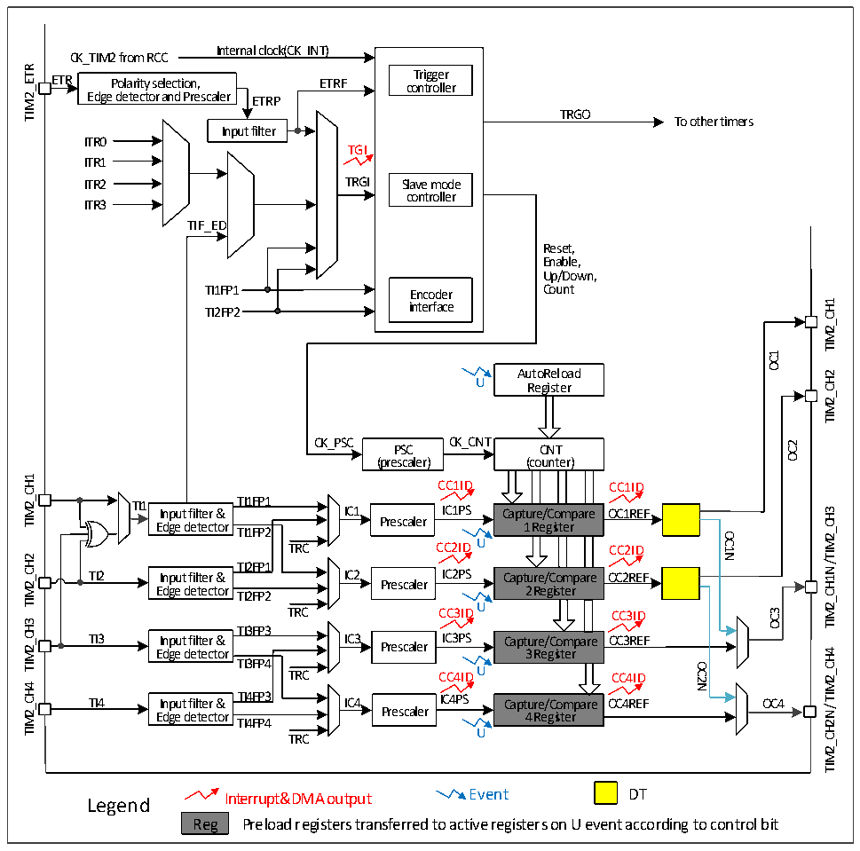

<!-- source-page: 156 -->

[← p.155](0155.md) · [index](../README.md) · [PDF p.156](https://ch32-riscv-ug.github.io/CH32V006/datasheet_en/CH32V00XRM.PDF#page=156) · [p.157 →](0157.md)

<!-- header: CH32V00X Reference Manual https://wch-ic.com -->

## 12.2 Principle and Structure

Figure 12-1 Block diagram of the structure of the general-purpose timer  
 <!-- rendered from the PDF; verify at https://ch32-riscv-ug.github.io/CH32V006/datasheet_en/CH32V00XRM.PDF#page=156 -->

🖼 Text parsed from the figure above

Internal clock(CK_INT)  
CK_TIM2 from RCC  
TIM2_ETR  
ETR Polarity selection, ETRF co T n ri t g r g o e lle r r  
Edge detector and Prescaler ETRP  
TRGO  
To other timers  
Input filter  
ITR0  
TGI  
ITR1  
ITR2 TRGI Slave mode  
controller  
ITR3  
TIF_ED  
Reset,  
Enable,  
Up/Down,  
TI1FP1 Encoder Count  
TIM2_CH1  
TI2FP2 interface  
OC1  
AutoReload  
TIM2_CH2  
U  
Register  
CK_PSC CK_CNT PSC CNT  
OC2  
(prescaler) (counter)  
ount  ter  r)  
TIM2_CH1  
CC1ID CC1ID  
TI1 Input filter &amp; TTII11FFPP11 IC1 IICC11PPSS Capture/Compare OC1REF  
/TIM2_CH3  
Edge detector Prescaler 1 Register  
TI1FP2  
OC1N  
TRC CC2ID U CC2ID  
TIM2_CH2  
TI2FP1 TI2 Input filter &amp; IC2 IC2PS Capture/Compare OC2REF  
TIM2_CH1N  
Prescaler  
Edge detector 2 Register  
TI2FP2  
TRC CC3IDU CC3ID  
OC3  
TIM2_CH3  
TI3FP3  
TI3 Input filter &amp; IC3 Prescaler IC3PS Capture/Compare OC3REF  
TIM2_CH4  
Edge detector 3 Register  
TI3FP4 TRC CC4ID U CC4ID  
OC2N  
TIM2_CH4  
TI4 Input filter &amp; TI4FP3 IC4 IC4PS Capture/Compare OC4REF OC4 Edge detector Prescaler 4 Register  
TIM2_CH2N/  
TI4FP4  
U  
TRC  
Legend Interrupt&amp;DMA output Event DT  
Reg Preload registers transferred to active registers on U event according to control bit  

### 12.2.1 Overview

As shown in Figure 12-1, the structure of the general-purpose timer can be roughly divided into three parts,  
namely the input clock part, the core counter part and the compare/capture channel part.  
The clock of the general-purpose timer can come from the HB bus clock (CK_INT), from the external clock input  
pin (TIM2_ETR), from other timers with clock output function (ITRx), or from the input of the compare/capture  
channel (TIM2_CHx). After various set filtering and frequency division operations, these input clock signals  
become CK_PSC clocks and output to the core counter. In addition, these complex clock sources can also be  
output as TRGO to other timers and ADC peripherals.  
The core of the general-purpose timer is a 16-bit counter (CNT). After the CK_PSC is divided by the prescaler  
(PSC), the CK_CNT is finally output to the CNT, CNT to support the increasing counting mode, the decreasing  
<!-- image: p156-draw-image-00001 bbox=[515.88, 783.6, 534.96, 793.8] -->
<!-- footer: V1.5 150 -->
