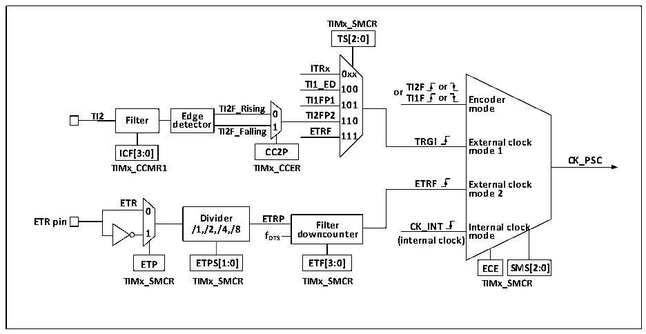

<!-- source-page: 157 -->

[← p.156](0156.md) · [index](../README.md) · [PDF p.157](https://ch32-riscv-ug.github.io/CH32V006/datasheet_en/CH32V00XRM.PDF#page=157) · [p.158 →](0158.md)

<!-- header: CH32V00X Reference Manual https://wch-ic.com -->
counting mode and the increasing or decreasing counting mode, and there is an automatic reload value register  
(ATRLR) to reload the initialization values for the CNT at the end of each counting cycle.  
The general-purpose timer has four sets of compare/capture channels, each of which can input pulses from  
exclusive pins or output waveforms to pins, i.e., the compare/capture channels support both input and output  
modes. The input of each channel of the compare/capture register supports filtering, dividing, edge detection, and  
other operations, and supports mutual triggering between channels, and can also provide clock for the core counter  
CNT. Each compare/capture channel has a set of compare/capture registers (CHxCVR) that support comparison  
with the main counter (CNT) to output pulses.  

### 12.2.2 Difference between General-purpose Timer and Advanced-control Timer

Compared to advanced-control timers, general purpose timers lack the following features.  
1) The general-purpose timer lacks a repeat count register for counting the count cycles of the core counter.  
2) The compare/capture channel of the general-purpose timer lacks dead-time generation and has no  
complementary output.  
3) The general-purpose timer does not have a brake signal mechanism.  

### 12.2.3 Clock Input

This section discusses the source of CK_PSC. The clock source portion of the overall block diagram of the  
general-purpose timer is captured here.  

Figure 12-2 General-purpose Timer CK_PSC Source Block Diagram  
 <!-- rendered from the PDF; verify at https://ch32-riscv-ug.github.io/CH32V006/datasheet_en/CH32V00XRM.PDF#page=157 -->

🖼 Text parsed from the figure above

<strong>TIMx_SMCR</strong>  
<strong>TS[2:0]</strong>  
<strong>ITRx</strong>  
<strong>0xx</strong>  
<strong>TI1_ED 100 or TI2F or</strong>  
<strong>TI1FP1 TI1F or Encoder</strong>  
<strong>TI2F_Rising 101 mode</strong>  
<strong>TI2 Filter de E t d e g c e tor TI2F_Falling 0 1 T E I2 T F R P F 2 110</strong>  
<strong>111</strong>  
<strong>TRGI External clock</strong>  
<strong>ICF[3:0] CC2P mode 1</strong>  
<strong>CK_PSC</strong>  
<strong>TIMx_CCMR1 TIMx_CCER</strong>  
<strong>ETRF External clock</strong>  
<strong>mode 2</strong>  
<strong>ETR</strong>  
<strong>0</strong>  
<strong>ETR pin 1 /1 D ,/ i 2 vi , d /4 e , r /8 E f T D R TS P dow F n i c lt o e u r nter (int C e K r _ n I a N l T clock) I m nt o e d r e nal clock</strong>  
<strong>ETP ETPS[1:0] ETF[3:0] ECE SMS[2:0]</strong>  
<strong>TIMx_SMCR TIMx_SMCR TIMx_SMCR TIMx_SMCR</strong>  

The optional input clocks can be divided into 4 categories.  
1) Route of the external clock pin (ETR) input: ETR → ETRP → ETRF.  
2) Internal HB clock input route: CK_INT.  
3) Route from the comparison capture channel pin (TIM2_CHx): TIMx_CHx → TIx → TIxFPx, this route is  
also used in encoder mode.  
4) Input from other internal timers: ITRx.  
The actual operation can be divided into 3 categories by determining the choice of input pulse for the SMS of the  
<!-- image: p157-draw-image-00001 bbox=[515.88, 783.6, 534.96, 793.8] -->
<!-- footer: V1.5 151 -->
