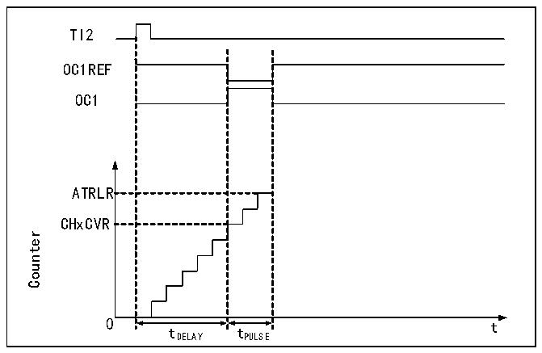

<!-- source-page: 162 -->

[← p.161](0161.md) · [index](../README.md) · [PDF p.162](https://ch32-riscv-ug.github.io/CH32V006/datasheet_en/CH32V00XRM.PDF#page=162) · [p.163 →](0163.md)

<!-- header: CH32V00X Reference Manual https://wch-ic.com -->
OCxREF rises to high when the core counter value is greater than the compare/capture register; when the core  
counter value is less than the compare/capture register (For example, when the core counter grows to the value of  
R16_TIM2_ATRLR and reverts to full 0), OCxREF falls to low.  
● Central alignment  
When using the central alignment modes, the core counter runs in alternating incremental and decremental count  
modes, and OCxREF performs rising and falling jumps when the values of the core counter and the  
compare/capture register match. However, the comparison flags are set at different times in the three central  
alignment modes. When using the central alignment modes, it is best to generate a software update flag (set the  
UG bit) before starting the core counter.  

### 12.3.6 Single Pulse Mode

The single pulse mode can respond to a specific event by generating a pulse after a delay, with programmable  
delay and pulse width. Setting the OPM bit stops the core counter when the next update event UEV is generated  
(counter flips to 0).  

Figure 12-4 Event generation and impulse response  
 <!-- rendered from the PDF; verify at https://ch32-riscv-ug.github.io/CH32V006/datasheet_en/CH32V00XRM.PDF#page=162 -->

🖼 Text parsed from the figure above

TI2  
OC1REF  
OC1  
ATRLR  
CHxCVR  
Counter  
0 t  
tDELAY tPULSE  

As shown in Figure 12-4, a positive pulse of length Tpulse needs to be generated on OC1 after a delay Tdelay at  
the beginning of a rising edge detected on the TI2 input pin.  
1) Set TI2 to trigger. Setting the CC2S field to 01b to map TI2FP2 to TI2; setting the CC2P bit to 0b to set  
TI2FP2 as rising edge detection; setting the TS field to 110b to set TI2FP2 as trigger source; setting the SMS  
field to 110b to set TI2FP2 to be used to start the counter.  
2) Tdelay is defined by the Compare/Capture Register and Tpulse is determined by the value of the Auto Reload  
Value Register and the Compare/Capture Register.  

### 12.3.7 Encoder Mode

The encoder mode is a typical application of the timer and can be used to access the biphasic output of the encoder.  
The counting direction of the core counter is synchronized with the direction of the encoder&#x27;s rotation axis, and  
each pulse output from the encoder will add or subtract one from the core counter. To use the encoder, set the SMS  
field to 001b (count only on TI2 edge), 010b (count only on TI1 edge) or 011b (count on both TI1 and TI2 edges),  
connect the encoder to the input of the compare/capture channels 1 and 2, and set a reload value counter value,  
which can be set to a larger value. When in encoder mode, the internal compare/capture register, prescaler, repeat  
<!-- image: p162-draw-image-00001 bbox=[515.88, 783.6, 534.96, 793.8] -->
<!-- footer: V1.5 156 -->
