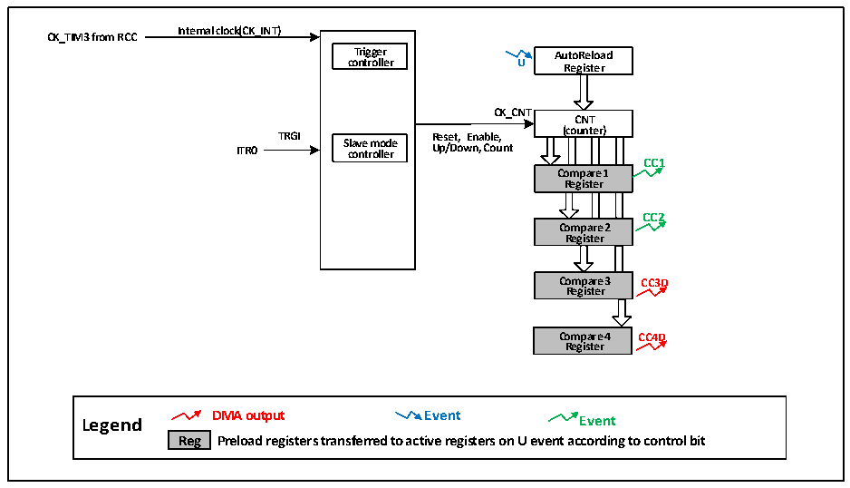

<!-- source-page: 184 -->

[← p.183](0183.md) · [index](../README.md) · [PDF p.184](https://ch32-riscv-ug.github.io/CH32V006/datasheet_en/CH32V00XRM.PDF#page=184) · [p.185 →](0185.md)

<!-- header: CH32V00X Reference Manual https://wch-ic.com -->

# Chapter 13 Streamlined Timer (SLTM)

<strong><em>The module description in this chapter applies only to CH32V006, CH32V007, and CH32M007 products.</em></strong>  
The Streamlined Timer module contains a 16-bit timer TIM3 that can be reinstalled automatically, which is used  
to generate pulses of a specific frequency (non-output) with TIM1 and ADC modules.  

## 13.1 Main Features

The main features of the streamlined timer include:  
● 16-bit auto-reload counter, supports incremental counting mode, decremental counting mode, incremental  
and decremental counting mode  
● Support 4 independent compare channels, only support output comparison  
● Support cascade synchronization with TIM1.  
● Support for using DMA  

## 13.2 Principle and Structure

Figure 13-1 Block diagram of the structure of the streamlined timer  
 <!-- rendered from the PDF; verify at https://ch32-riscv-ug.github.io/CH32V006/datasheet_en/CH32V00XRM.PDF#page=184 -->

🖼 Text parsed from the figure above

<strong>Internal clock(CK_INT)</strong>  
<strong>CK_TIM3 from RCC</strong>  
<strong>Trigger AutoReload</strong>  
<strong>controller U Register</strong>  
<strong>CK_CNT</strong>  
<strong>CNT</strong>  
<strong>(counter)</strong>  
<strong>TRGI Reset, Enable,</strong>  
oun  nte  er)  
<strong>ITR0 S c la o v n e t r m ol o le d r e Up/Down, Count</strong>  
<strong>CC1</strong>  
<strong>Compare 1</strong>  
<strong>Register</strong>  
<strong>CC2</strong>  
<strong>Compare 2</strong>  
<strong>Register</strong>  
<strong>Compare 3 CC3D</strong>  
<strong>Register</strong>  
<strong>Compare 4 CC4D</strong>  
<strong>Register</strong>  
<strong>Legend DMA output Event Event</strong>  
<strong>Reg Preload registers transferred to active registers on U event according to control bit</strong>  

### 13.2.1 Overview

As shown in Figure 13-1, the structure of the streamlined timer can be roughly divided into three parts, namely the  
input clock part, the core counter part and the compare channel part.  
The clock of the streamlined timer can come from the HB bus clock (CK_INT) and from other timers (ITR1) with  
clock output function. After the set filtering operation, these input clock signals become CK_PSC clocks and  
output to the core counter.  
The core of the streamlined timer is a 16-bit counter (CNT). CK_PSC input directly to CNT, CNT without  
<!-- image: p184-draw-image-00001 bbox=[515.88, 783.6, 534.96, 793.8] -->
<!-- footer: V1.5 178 -->
