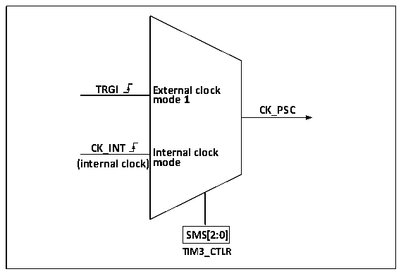

<!-- source-page: 185 -->

[← p.184](0184.md) · [index](../README.md) · [PDF p.185](https://ch32-riscv-ug.github.io/CH32V006/datasheet_en/CH32V00XRM.PDF#page=185) · [p.186 →](0186.md)

<!-- header: CH32V00X Reference Manual https://wch-ic.com -->
frequency division supports incremental counting mode, decremental counting mode and incremental or  
decremental counting mode, and has an automatic reload value register (ATRLR) to reload initialization values for  
CNT at the end of each counting cycle.  
The streamlined timer has four sets of compare channels, each of which has a set of compare registers (CHxCVR).  
Channels 1 and 2 support comparison with the master counter (CNT) and output pulses, that is, only the output  
mode; channels 3 and 4 support the comparison of the main counter (CNT) to generate DMA requests.  

### 13.2.2 Clock Input

This section discusses the source of CK_PSC. The clock source part of the overall structure block diagram of the  
streamlined timer is intercepted here.  

Figure 13-2 Streamlined timer CK_PSC source block diagram  
 <!-- rendered from the PDF; verify at https://ch32-riscv-ug.github.io/CH32V006/datasheet_en/CH32V00XRM.PDF#page=185 -->

🖼 Text parsed from the figure above

<strong>TRGI External clock</strong>  
<strong>mode 1</strong>  
<strong>CK_PSC</strong>  
<strong>CK_INT Internal clock</strong>  
<strong>(internal clock)mode</strong>  
<strong>SMS[2:0]</strong>  
<strong>TIM3_CTLR</strong>  

The optional input clocks can be divided into 2 categories.  
1) Internal HB clock input route: CK_INT  
2) Input from other internal timers: ITRx.  
By determining the input pulse selection of the SMS from which the CK_PSC comes from, the actual operation  
can be divided into two categories:  
1) Select internal clock source (CK_INT)  
2) External clock source mode 1  
The two clock sources mentioned above can be selected by these two operations.  

#### 13.2.2.1 Internal Clock Source (CK_INT)

If the compact timer is started when the SMS domain is kept at 000b, the internal clock source (CK_INT) is  
selected as the clock. At this point, CK_INT is CK_PSC.  

#### 13.2.2.2 External Clock Source Mode 1

If the SMS domain is set to 111b, external clock source mode 1 is enabled. When the external clock source 1 is  
enabled, the source from which TRGI is selected as the CK_PSC is the internally triggered ITR1.  

### 13.2.3 Counters and Peripherals

CK_PSC is directly CK_INT without frequency division. Reduced timer no counting clock pre-division function.  
<!-- image: p185-draw-image-00001 bbox=[515.88, 783.6, 534.96, 793.8] -->
<!-- footer: V1.5 179 -->
