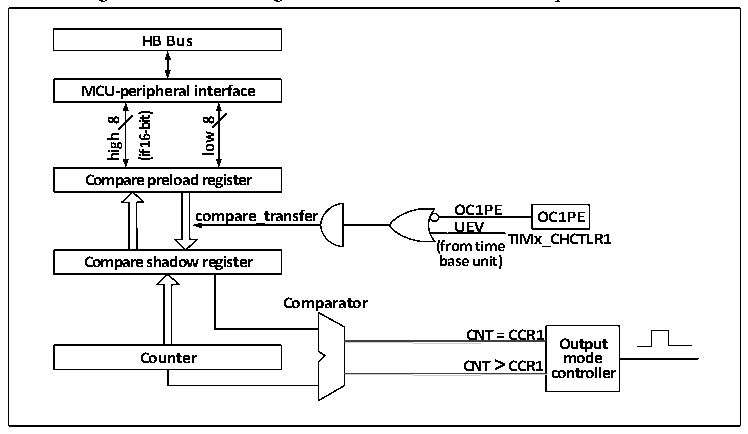

<!-- source-page: 186 -->

[← p.185](0185.md) · [index](../README.md) · [PDF p.186](https://ch32-riscv-ug.github.io/CH32V006/datasheet_en/CH32V00XRM.PDF#page=186) · [p.187 →](0187.md)

<!-- header: CH32V00X Reference Manual https://wch-ic.com -->

### 13.2.4 Compare Channel

The compare channel is the core of the timer to achieve complex functions, and its core is the compare register,  
supplemented by the output comparator. The structural block diagram of the compare channel is shown in figure  
13-3.  

Figure 13-3 Block diagram of the structure of the compare channel  
 <!-- rendered from the PDF; verify at https://ch32-riscv-ug.github.io/CH32V006/datasheet_en/CH32V00XRM.PDF#page=186 -->

🖼 Text parsed from the figure above

<strong>HB Bus</strong>  
<strong>MCU-peripheral interface</strong>  
<strong>16-bit)</strong>  
<strong>8</strong>  
<strong>8</strong>  
<strong>low</strong>  
<strong>high</strong>  
<strong>(if</strong>  
<strong>Compare preload register</strong>  
<strong>compare_transfer OC1PE OC1PE</strong>  
<strong>UEV</strong>  
<strong>TIMx_CHCTLR1</strong>  
<strong>(from time</strong>  
<strong>base unit)</strong>  
<strong>Compare shadow register</strong>  
<strong>Comparator</strong>  
<strong>CNT = CCR1</strong>  
<strong>Output</strong>  
<!-- image: p186-draw-image-00002 inside the figure -->
<strong>Counter CNT &gt; CCR1 mode</strong>  
<strong>controller</strong>  
<!-- image: p186-draw-image-00003 inside the figure -->

The compare register consists of a preload register and a shadow register, and the read and write process operates  
only the preload register. During comparison, the contents of the preloaded register are copied to the shadow  
register, and then the contents of the shadow register are compared with the core counter (CNT).  

## 13.3 Function and Implementation

The complex functions of the streamlined timer are realized by operating the compare channel of the timer, the  
clock input circuit, the counter and the surrounding components. The clock input of the timer may come from two  
clock sources including an internal clock source and trigger inputs of other timers. The operation of comparing the  
register channel and the clock source directly determines its function. The compare channel is unidirectional and  
only works in output mode.  

### 13.3.1 Compare Output Mode

Compare output mode is one of the basic functions of timer. The principle of the compare output mode is that  
when the value of the core counter (CNT) is consistent with the value of the compare register, channel 1 ~ 2  
outputs a specific waveform. Channel 3pr 4 generates a DMA request if the CCxDE bit is set in advance when a  
relatively consistent event is generated.  
The steps to configure to compare output modes are as follows:  
1) Configure the clock source and automatic reload values of the core counter (CNT)  
2) Set the count value to be compared to the compare register (R16_TIMx_CHxCVR)  
3) Keep OCxPE to 0 and disable preloaded registers that compare the obtained registers  
4) Set the CEN bit to start the timer.  

### 13.3.2 Timer Synchronization Mode

The timer can only receive input from timer 1 (ITRx). The connection is triggered inside the timer as shown in  
Table 13-1.  
<!-- image: p186-draw-image-00001 bbox=[515.88, 783.6, 534.96, 793.8] -->
<!-- footer: V1.5 180 -->
