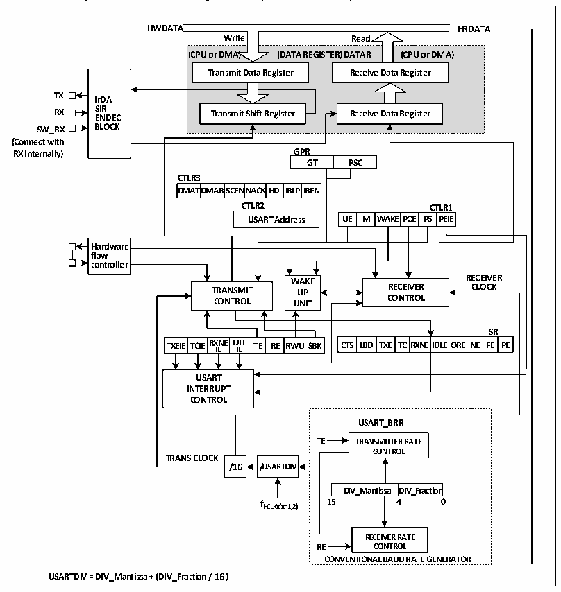

<!-- source-page: 192 -->

[← p.191](0191.md) · [index](../README.md) · [PDF p.192](https://ch32-riscv-ug.github.io/CH32V006/datasheet_en/CH32V00XRM.PDF#page=192) · [p.193 →](0193.md)

<!-- header: CH32V00X Reference Manual https://wch-ic.com -->
● Multiple interrupt sources  

## 14.2 Overview

Figure 14-1 Block diagram of synchronous/asynchronous transceiver  
 <!-- rendered from the PDF; verify at https://ch32-riscv-ug.github.io/CH32V006/datasheet_en/CH32V00XRM.PDF#page=192 -->

🖼 Text parsed from the figure above

<strong>HWDATA HRDATA</strong>  
<!-- image: p192-draw-image-00004 inside the figure -->
<!-- image: p192-draw-image-00003 inside the figure -->
<strong>Write Read</strong>  
<strong>(CPU or DMA) (DATA REGISTER) DATAR (CPU or DMA)</strong>  
Transmit Data Register  
<strong>Transmit Data Register Receive Data Register</strong>  
<!-- image: p192-draw-image-00002 inside the figure -->
<!-- image: p192-draw-image-00005 inside the figure -->
<strong>TX IrDA</strong>  
<strong>RX S E I N R DEC Transmit Shift Register Receive Data Register</strong>  
<strong>SW_RX BLOCK</strong>  
<strong>(Connect with</strong>  
<strong>RX Internally) GPR</strong>  
GPRGT  PSC  
<strong>CTLR3</strong>  
DMAT  TDMAR  SCENNA  ACKHD  IRLP  
<strong>DMATDMARSCENNACKHD IRLPIREN</strong>  
<strong>CTLR2 CTLR1</strong>  
WAK  KEPCE  PSCTPLRE  ERI1E  
Hardware flow controller  
<strong>WWAAKKEE RECEIVER</strong>  
<strong>TRANSMIT UUPP RECEIVER CLOCK</strong>  
<strong>CONTROL UUNNIITT CONTROL</strong>  
TXEIE  TCIE  RXNEIDIE  ID IE LE  TE RE  RWU  
<strong>SR</strong>  
CTS LBD  TXE  TC  RXNE  EIDLE  EORE  NE  FSER  RPE  
<strong>USART</strong>  
<strong>INTERRUPT</strong>  
<strong>CONTROL</strong>  
<strong>USART_BRR</strong>  
<strong>TE TRANSMITTER RATE</strong>  
<strong>CONTROL</strong>  
<strong>TRANS CLOCK</strong>  
<strong>/16 /USARTDIV</strong>  
DIV_Mantissa  DIV_Fraction  
<strong>fHCLKx(x=1,2) 15 4 0</strong>  
<strong>RECEIVER RATE</strong>  
<strong>RE CONTROL</strong>  
<strong>CONVENTIONAL BAUD RATE GENERATOR</strong>  
<strong>USARTDIV = DIV_Mantissa + (DIV_Fraction / 16 )</strong>  

When the TE (transmit enable bit) is set, the data in the transmit shift register is output on the TX pin. When  
transmitting, the least significant bits are removed first, and each data frame starts with a low-level start bit, and  
then the transmitter sends eight-or nine-bit data words according to the setting on the M (word length) bit, and  
finally the number of configurable stop bits. If there is a parity bit, the last bit of the data word is the parity bit.  
After the TE is set, an idle frame is sent, which is 10-or 11-bit high, including the stop bit. The break frame is  
10-or 11-bit low, followed by the stop bit.  

## 14.3 Baud Rate Generator

The baud rate of the transceiver = HCLK/ (16*USARTDIV), and HCLK is the clock of HB. The value of  
USARTDIV is determined based on the fields DIV_M and DIV_F in USART_BRR. The formula for calculation  
is:  
USARTDIV = DIV_M + (DIV_F/16)  
<!-- image: p192-draw-image-00001 bbox=[515.88, 783.6, 534.96, 793.8] -->
<!-- footer: V1.5 186 -->
