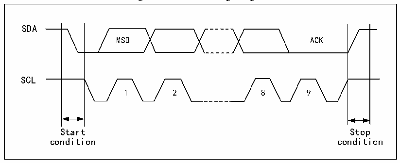

<!-- source-page: 202 -->

[← p.201](0201.md) · [index](../README.md) · [PDF p.202](https://ch32-riscv-ug.github.io/CH32V006/datasheet_en/CH32V00XRM.PDF#page=202) · [p.203 →](0203.md)

<!-- header: CH32V00X Reference Manual https://wch-ic.com -->

# Chapter 15 Inter-integrated Circuit (I2C) interface

<strong><em>The module description in this chapter applies only to CH32V002, CH32V004, CH32V005, CH32V006,</em></strong>  
<strong><em>CH32V007, and CH32M007 products.</em></strong>  
The internal integrated circuit bus (I2C) is widely used in the communication between microcontrollers, sensors  
and other off-chip modules. It supports multi-master and multi-slave mode, and can communicate at both 100kHz  
(Standard) and 400kHz (Fast) speeds using only two wires (SDA and SCL).  

## 15.1 Main Features

● Support master and slave modes  
● Support 7-bit or 10-bit addresses  
● Slave devices support dual 7-bit addresses  
● Support 2 speed modes: 100kHz and 400kHz  
● Multiple status modes, multiple error flags  
● Support extended clock function  
● 2 interrupt vectors  
● DMA support  
● Support PEC  

## 15.2 Overview

I2C is a half-duplex bus, which can only run in one of the following four modes: master device transmitting mode,  
master device receiving mode, slave device transmitting mode and slave device receiving mode. The I2C module  
works in slave mode by default. After generating the starting condition, it will automatically switch to the master  
mode. When the arbitration is lost or a stop signal is generated, it will switch to the slave mode. The I2C module  
supports multi-host functions. When working in master mode, the I2C module will actively send out data and  
addresses. Data and addresses are transmitted in 8-bit units, with the high bit in front and the low bit in the back.  
After the start event is a byte (7-bit address mode) or two-byte (10-bit address mode) address. Every time the host  
sends 8-bit data or address, the slave needs to reply a reply ACK, that is, pull down the SDA bus, as shown in  
figure 15-1.  

Figure 15-1 I2C Timing Diagram  
 <!-- rendered from the PDF; verify at https://ch32-riscv-ug.github.io/CH32V006/datasheet_en/CH32V00XRM.PDF#page=202 -->

🖼 Text parsed from the figure above

SDA  
MSB ACK  
SCL  
1 2 8 9  
Start Stop  
condition condition  

In order to use it normally, the correct clock must be input to I2C. In standard mode, the lowest input clock is  
<!-- image: p202-draw-image-00001 bbox=[515.88, 783.6, 534.96, 793.8] -->
<!-- footer: V1.5 196 -->
