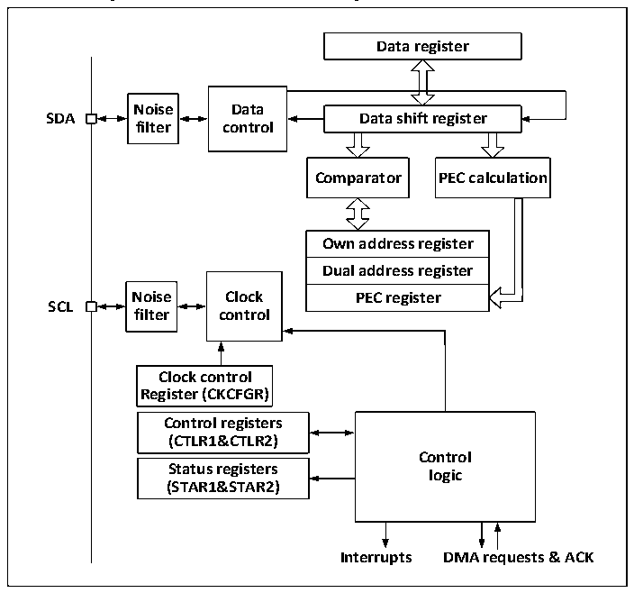

<!-- source-page: 203 -->

[← p.202](0202.md) · [index](../README.md) · [PDF p.203](https://ch32-riscv-ug.github.io/CH32V006/datasheet_en/CH32V00XRM.PDF#page=203) · [p.204 →](0204.md)

<!-- header: CH32V00X Reference Manual https://wch-ic.com -->
2MHz, and in fast mode, the lowest input clock is 4MHz.  
Figure 15-2 is the functional block diagram of the I2C module.  

Figure 15-2 Functional block diagram of the I2C module  
 <!-- rendered from the PDF; verify at https://ch32-riscv-ug.github.io/CH32V006/datasheet_en/CH32V00XRM.PDF#page=203 -->

🖼 Text parsed from the figure above

<strong>Data register</strong>  
<strong>Noise Data</strong>  
<strong>SDA Data shift register</strong>  
<strong>filter control</strong>  
<strong>Comparator PEC calculation</strong>  
Own address register  Dual address register  PEC register  
<strong>Noise Clock PEC register</strong>  
<strong>SCL</strong>  
<strong>filter control</strong>  
<strong>Clock control</strong>  
<strong>Register (CKCFGR)</strong>  
Control registers (CTLR1&amp;CTLR2)  Status registers (STAR1&amp;STAR2)  
<strong>Control</strong>  
<strong>logic</strong>  
<strong>Interrupts DMA requests &amp; ACK</strong>  

## 15.3 Master Mode

In master mode, the I2C module dominates the data transmission and outputs the clock signal. The data  
transmission begins with the start event and ends with the end event. The steps to communicate using main mode  
are:  
Set the correct clock in the control register 2 (R16_I2C1_CTLR2) and the clock control register  
(R16_I2C1_CKCFGR);  
Set the appropriate rising edge in the rising edge register (R16_I2C1_RTR);  
Set the PE bit in the control register (R16_I2C1_CTLR1) to start the peripheral;  
Set the START bit in the control register (R16_I2C1_CTLR1) to generate a start event.  
After setting the START bit, the I2C module will automatically switch to the main mode, the MSL bit will be set,  
and the starting event will be generated. After the initial event is generated, the SB bit will be set, and if the  
ITEVTEN bit (in R16_I2C1_CTLR2) is set, it will be interrupted. At this point, the status register 1  
(R16_I2C1_STAR1) should be read. After writing from the address to the data register, the SB bit will be cleared  
automatically.  
If the 10-bit address mode is used, then write the data register send header sequence (the header order is listed as  
11110xx0b, where the xx bit is the highest two bits of the 10-bit address).  
After sending the header sequence, the ADD10 bit of the status register will be set, and if the ITEVTEN bit has  
been set, an interrupt will occur. After reading the R16_I2C1_STAR1 register, write the second address byte to the  
data register, and clear the ADD10 bit.  
<!-- image: p203-draw-image-00001 bbox=[515.88, 783.6, 534.96, 793.8] -->
<!-- footer: V1.5 197 -->
