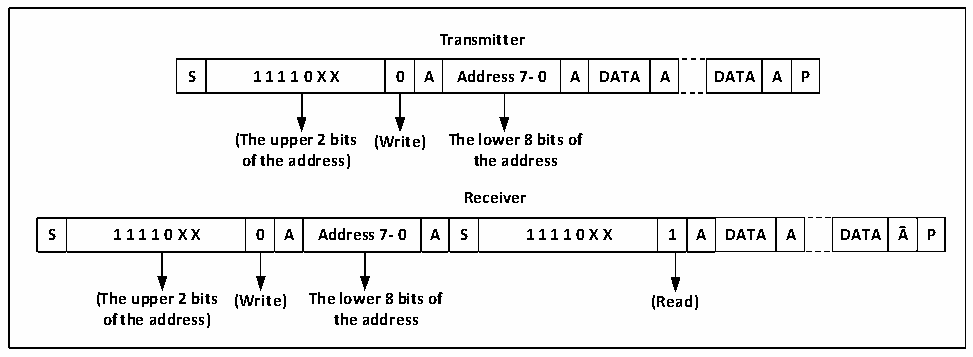

<!-- source-page: 204 -->

[← p.203](0203.md) · [index](../README.md) · [PDF p.204](https://ch32-riscv-ug.github.io/CH32V006/datasheet_en/CH32V00XRM.PDF#page=204) · [p.205 →](0205.md)

<!-- header: CH32V00X Reference Manual https://wch-ic.com -->
Then write the data register to send the second address byte. After sending the second address byte, the ADDR bit  
of the status register will be set. If the ITEVTEN bit has been set, it will cause an interrupt. In this case, you  
should read the R16_I2C1_STAR1 register and read the R16_I2C1_STAR2 register again to clear the ADDR bit.  
If the 7-bit address mode is used, the write data register sends address bytes. After the address bytes are sent, the  
ADDR bit of the status register will be set, and if the ITEVTEN bit has been set, an interrupt will occur. At this  
time, you should read the R16_I2C1_STAR1 register and read the R16_I2C1_STAR2 register again to clear the  
ADDR bit.  
In 7-bit address mode, the first byte sent is the address byte, the first 7 bits represent the address of the target slave  
device, the 8th bit determines the direction of the subsequent message, 0 indicates that the master device writes  
data to the slave device, and 1 represents that the master device reads information from the slave device.  
In the 10-bit address mode, as shown in Figure 15-3, during the send address phase, the first byte is 11110xx0, xx  
is the highest 2 bits of the 10-bit address, and the second byte is the lower 8 bits of the 10-bit address. If you  
subsequently enter the master device transmit mode, you will continue to send data; if you subsequently prepare to  
enter the master device receive mode, you will need to re-send a start condition to follow the sending of a byte as  
11110xx1, and then enter the master device receive mode.  

Figure 15-3 Schematic diagram of master transmitting and receiving data at 10-bit address  
 <!-- rendered from the PDF; verify at https://ch32-riscv-ug.github.io/CH32V006/datasheet_en/CH32V00XRM.PDF#page=204 -->

🖼 Text parsed from the figure above

<strong>Transmitter</strong>  
S  1 1 1 1 0 X X  0  A  Address 7- 0  A  DATA  A  DATA  A  P  
<strong>(The upper 2 bits (Write) The lower 8 bits of</strong>  
<strong>of the address) the address</strong>  
<strong>Receiver</strong>  
S  1 1 1 1 0 X X  0  A  Address 7- 0  A  S  1 1 1 1 0 X X  1  A  DATA  A  DATA  A  P  
<strong>(The upper 2 bits (Write) The lower 8 bits of (Read)</strong>  
<strong>of the address) the address</strong>  

Master transmit mode:  
The shift register inside the main device transmits data from the data register to the SDA line. When the master  
device receives the ACK, the TxE of the status register 1 (R16_I2C1_STAR1) is set, and an interrupt occurs if the  
ITEVTEN and ITBUFEN are set. Writing data to the data register clears the TxE bit.  
If the TxE bit is set and no new data is written to the data register before the last data is sent, then the BTF bit will  
be set, the SCL will remain low until it is cleared, and after reading the R16_I2C1_STAR1, writing data to the  
data register will clear the BTF bit.  
<!-- image: p204-draw-image-00001 bbox=[515.88, 783.6, 534.96, 793.8] -->
<!-- footer: V1.5 198 -->
