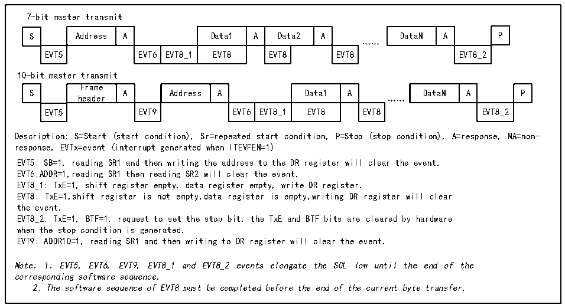
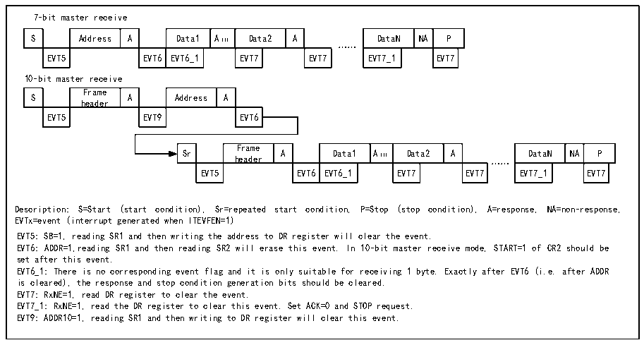

<!-- source-page: 205 -->

[← p.204](0204.md) · [index](../README.md) · [PDF p.205](https://ch32-riscv-ug.github.io/CH32V006/datasheet_en/CH32V00XRM.PDF#page=205) · [p.206 →](0206.md)

<!-- header: CH32V00X Reference Manual https://wch-ic.com -->

Figure 15-4 Master transmitter transmission sequence diagram  
 <!-- rendered from the PDF; verify at https://ch32-riscv-ug.github.io/CH32V006/datasheet_en/CH32V00XRM.PDF#page=205 -->

🖼 Text parsed from the figure above

7-bit master transmit  
S  Address  A  Data1  A  Data2  A  EVT5  EVT6  EVT8_1  EVT8  EVT8  EVT8  
DataN  A  P  EVT8_2  
……  
10-bit master transmit  
S  Frame header  A  Address  A  Data1  A  EVT5  EVT9  EVT6  EVT8_1  EVT8  EVT8  
DataN  A  P  EVT8_2  
Description: S=Start (start condition), Sr=repeated start condition, P=Stop (stop condition), A=response, NA=non-  
response, EVTx=event (interrupt generated when ITEVFEN=1)  
EVT5: SB=1, reading SR1 and then writing the address to the DR register will clear the event.  
EVT6;ADDR=1,reading SR1 then reading SR2 will clear the event.  
EVT8_1: TxE=1, shift register empty, data register empty, write DR register.  
EVT8: TxE=1,shift register is not empty,data register is empty,writing DR register will clear  
the event.  
EVT8_2: TxE=1, BTF=1, request to set the stop bit. the TxE and BTF bits are cleared by hardware  
when the stop condition is generated.  
EVT9: ADDR10=1, reading SR1 and then writing to DR register will clear the event.  
Note: 1: EVT5, EVT6, EVT9, EVT8_1 and EVT8_2 events elongate the SCL low until the end of the  
corresponding software sequence.  
2: The software sequence of EVT8 must be completed before the end of the current byte transfer.  

Master receive mode:  
The I2C module receives data from the SDA line and writes it into the data register through the shift register. After  
each byte, if the ACK bit is set, the I2C module will issue a low level of reply, while the RxNe bit will be set, and  
if ITEVTEN and ITBUFEN are set, there will be an interruption. If the RxNE is set and the original data is not  
read before the new data is received, the BTF bit will be set, the SCL will remain low before clearing the BTF,  
and reading the R16_I2C1_STAR1 and then reading the data register will clear the BTF bit.  

Figure 15-5 Receiver transmission sequence diagram  
 <!-- rendered from the PDF; verify at https://ch32-riscv-ug.github.io/CH32V006/datasheet_en/CH32V00XRM.PDF#page=205 -->

🖼 Text parsed from the figure above

7-bit master receive  
S  Address  A  Data1  A（1）  Data2  A  EVT5  EVT6  EVT6_1  EVT7  EVT7  
DataN  NA  P  EVT7_1  EVT7  
……  
10-bit master receive  
S  Frame header  A  Address  A  EVT5  EVT9  EVT6  
Sr  Frame header  A  Data1  A（1）  Data2  A  EVT5  EVT6  EVT6_1  EVT7  EVT7  
DataN  NA  P  EVT7_1  EVT7  
……  
Description: S=Start (start condition), Sr=repeated start condition, P=Stop (stop condition), A=response, NA=non-response,  
EVTx=event (interrupt generated when ITEVFEN=1)  
EVT5: SB=1, reading SR1 and then writing the address to DR register will clear the event.  
EVT6: ADDR=1,reading SR1 and then reading SR2 will erase this event. In 10-bit master receive mode, START=1 of CR2 should be  
set after this event.  
EVT6_1: There is no corresponding event flag and it is only suitable for receiving 1 byte. Exactly after EVT6 (i.e. after ADDR  
is cleared), the response and stop condition generation bits should be cleared.  
EVT7: RxNE=1, read DR register to clear the event.  
EVT7_1: RxNE=1, read the DR register to clear this event. Set ACK=0 and STOP request.  
EVT9: ADDR10=1, reading SR1 and then writing to DR register will clear this event.  

When the master device ends sending data, it will actively send an end event, that is, set the STOP bit, and I2C  
will switch to slave mode. In the receive mode, the master device needs to NAK at the answer position of the last  
data bit. After receiving the NACK, the slave device releases control over the SCL and SDA lines; the master  
device can send a stop / restart condition. Note that after the stop condition is generated, the I2C module will  
<!-- image: p205-draw-image-00001 bbox=[515.88, 783.6, 534.96, 793.8] -->
<!-- footer: V1.5 199 -->
