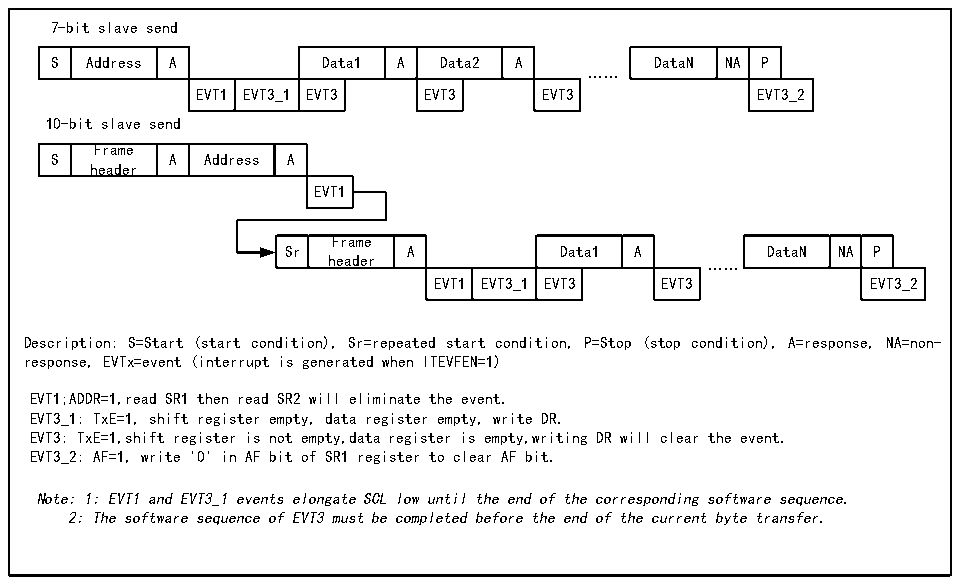
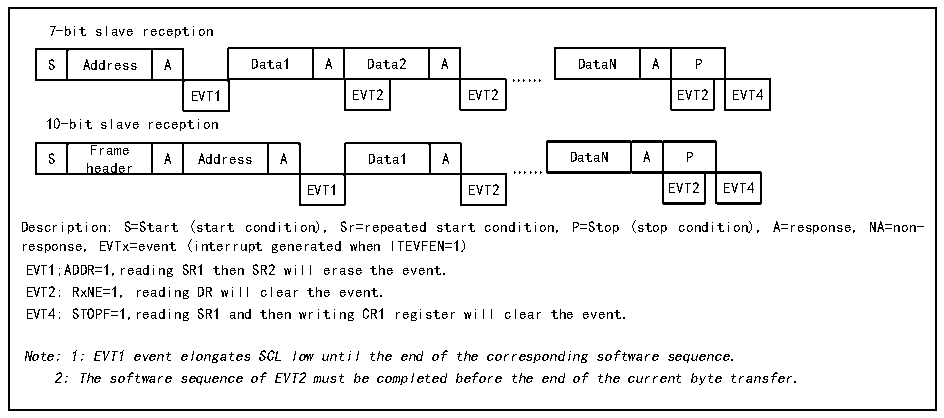

<!-- source-page: 207 -->

[← p.206](0206.md) · [index](../README.md) · [PDF p.207](https://ch32-riscv-ug.github.io/CH32V006/datasheet_en/CH32V00XRM.PDF#page=207) · [p.208 →](0208.md)

<!-- header: CH32V00X Reference Manual https://wch-ic.com -->

Figure 15-6 Slave transmitter transmission sequence diagram  
 <!-- rendered from the PDF; verify at https://ch32-riscv-ug.github.io/CH32V006/datasheet_en/CH32V00XRM.PDF#page=207 -->

🖼 Text parsed from the figure above

7-bit slave send  
S  Address  A  Data1  A  Data2  A  EVT1  EVT3_1  EVT3  EVT3  EVT3  
DataN  NA  P  EVT3_2  
……  
10-bit slave send  
S  Frame header  A  Address  A  EVT1  
Sr  Frame header  A  Data1  A  EVT1  EVT3_1  EVT3  EVT3  
DataN  NA  P  EVT3_2  
……  
Description: S=Start (start condition), Sr=repeated start condition, P=Stop (stop condition), A=response, NA=non-  
response, EVTx=event (interrupt is generated when ITEVFEN=1)  
EVT1;ADDR=1,read SR1 then read SR2 will eliminate the event.  
EVT3_1: TxE=1, shift register empty, data register empty, write DR.  
EVT3: TxE=1,shift register is not empty,data register is empty,writing DR will clear the event.  
EVT3_2: AF=1, write &#x27;0&#x27; in AF bit of SR1 register to clear AF bit.  
Note: 1: EVT1 and EVT3_1 events elongate SCL low until the end of the corresponding software sequence.  
2: The software sequence of EVT3 must be completed before the end of the current byte transfer.  

Slave receive mode:  
After the ADDR is cleared, the I2C module stores the data on the SDA into the data register through the shift  
register. After each byte is received, the I2C module will set an ACK bit and a RxNE bit. If ITEVTEN and  
ITBUFEN are set, an interrupt is also generated. If the RxNE is set and the old data is not read out before the new  
data is received, then the BTF will be set. The SCL stays low until the BTF bit is cleared. Reading the status  
register 1 (R16_I2C1_STAR1) and reading the data in the data register clears the BTF bit.  

Figure 15-7 Receiver transmission sequence diagram  
 <!-- rendered from the PDF; verify at https://ch32-riscv-ug.github.io/CH32V006/datasheet_en/CH32V00XRM.PDF#page=207 -->

🖼 Text parsed from the figure above

7-bit slave reception  
S  Address  A  Data1  A  Data2  A  EVT1  EVT2  EVT2  
DataN  A  P  EVT2  EVT4  
……  
10-bit slave reception  
S  Frame header  A  Address  A  Data1  A  EVT1  EVT2  
DataN  A  P  EVT4  
EVT1 EVT2 EVT2 EVT4  
Description: S=Start (start condition), Sr=repeated start condition, P=Stop (stop condition), A=response, NA=non-  
response, EVTx=event (interrupt generated when ITEVFEN=1)  
EVT1;ADDR=1,reading SR1 then SR2 will erase the event.  
EVT2: RxNE=1, reading DR will clear the event.  
EVT4: STOPF=1,reading SR1 and then writing CR1 register will clear the event.  
Note: 1: EVT1 event elongates SCL low until the end of the corresponding software sequence.  
2: The software sequence of EVT2 must be completed before the end of the current byte transfer.  

After the master device transmits the last data byte, it will produce a stop condition. When the I2C module detects  
the stop event, it will set the STOPF bit, and if the ITEVFEN bit is set, it will also produce an interrupt. The user  
needs to read the status register (R16_I2C1_STAR1) and then write the control register (Such as the reset control  
word SWRST) to clear. (See EVT4 in the figure above).  
<!-- image: p207-draw-image-00001 bbox=[515.88, 783.6, 534.96, 793.8] -->
<!-- footer: V1.5 201 -->
