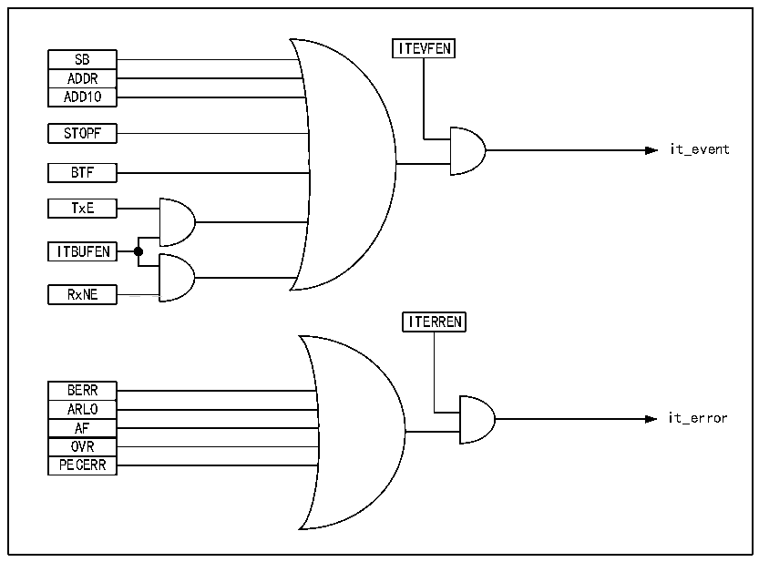

<!-- source-page: 209 -->

[← p.208](0208.md) · [index](../README.md) · [PDF p.209](https://ch32-riscv-ug.github.io/CH32V006/datasheet_en/CH32V00XRM.PDF#page=209) · [p.210 →](0210.md)

<!-- header: CH32V00X Reference Manual https://wch-ic.com -->

## 15.7 Interrupts

Each I2C module has two kinds of interrupt vectors, which are event interrupt and error interrupt. The two  
interrupts support the interrupt source in figure 15-8.  

Figure 15-8 I2C Interrupt Request  
 <!-- rendered from the PDF; verify at https://ch32-riscv-ug.github.io/CH32V006/datasheet_en/CH32V00XRM.PDF#page=209 -->

🖼 Text parsed from the figure above

ITEVFEN  
SB  ADDR  ADD10  
STOPF  
it_event  
BTF  
TxE  
ITBUFEN  
RxNE  
<!-- image: p209-draw-image-00002 inside the figure -->
ITERREN  
BERR  ARLO  AF  OVR  PECERR  
it_error  

## 15.8 DMA

You can use DMA to send and receive bulk data. The ITBUFEN bit of the control register cannot be set when  
using DMA.  
● Use DMA to transmit  
The DMA mode can be activated by setting the DMAEN position bit of the CTLR2 register. As long as the TxE  
bit is set, the data will be loaded by the DMA from the set memory into the I2C data register. The following  
settings are required to assign channels to I2C.  
1) The I2C1_DATAR register address is set to the DMA_PADDRx register, and the memory address is set in  
the DMA_MADDRx register, so that after each TxE event, data is sent from the memory to the  
I2C1_DATAR register.  
2) Set the required number of transfer bytes in the DMA_CNTRx register. This value is decremented after each  
TxE event.  
3) Configure the channel priority using the PL[0:1] bits in the DMA_CFGRx register.  
4) Set the DIR bit in the DMA_CFGRx register, and according to the application requirements, you can  
configure to issue an interrupt request when the whole transmission is half or all complete.  
5) Activate the channel by setting the EN bit on the DMA_CFGRx register.  
When the number of data transfers set in the DMA controller has been completed, the DMA controller sends an  
<!-- image: p209-draw-image-00001 bbox=[515.88, 783.6, 534.96, 793.8] -->
<!-- footer: V1.5 203 -->
