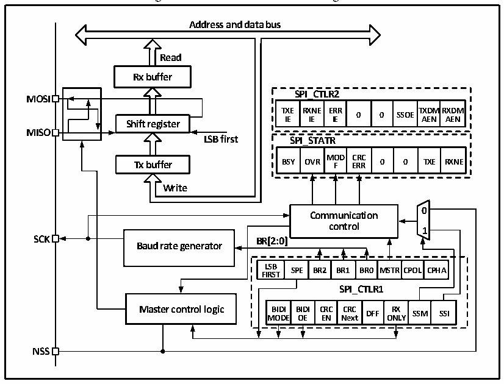

<!-- source-page: 220 -->

[← p.219](0219.md) · [index](../README.md) · [PDF p.220](https://ch32-riscv-ug.github.io/CH32V006/datasheet_en/CH32V00XRM.PDF#page=220) · [p.221 →](0221.md)

<!-- header: CH32V00X Reference Manual https://wch-ic.com -->

Figure 16-1 SPI structure block diagram  
 <!-- rendered from the PDF; verify at https://ch32-riscv-ug.github.io/CH32V006/datasheet_en/CH32V00XRM.PDF#page=220 -->

🖼 Text parsed from the figure above

<strong>Address and data bus</strong>  
<!-- image: p220-draw-image-00004 inside the figure -->
<strong>Read</strong>  
<strong>Rx buffer</strong>  
<strong>SPI_CTLR2</strong>  
<strong>MOSI</strong>  
<strong>TXE RXNE ERR TXDMRXDM</strong>  
<strong>0 0 SSOE</strong>  
<strong>IE IE IE AEN AEN</strong>  
<strong>Shift register</strong>  
<strong>MISO</strong>  
<strong>LSB first SPI_STATR</strong>  
<strong>MOD CRC</strong>  
<strong>Tx buffer BSY OVR F ERR 0 0 TXE RXNE</strong>  
<strong>Write</strong>  
<!-- image: p220-draw-image-00002 inside the figure -->
<!-- image: p220-draw-image-00003 inside the figure -->
<strong>0</strong>  
<strong>Communication</strong>  
<strong>control</strong>  
<strong>1</strong>  
<strong>SCK BR[2:0]</strong>  
<strong>Baud rate generator</strong>  
BR[2:0]  LSBFIRST  SPE  BR2  BR1  BR0  MSTR  RCPOL  CPHA  
<strong>SPI_CTLR1</strong>  
BIDIMODE  BIDIOE  CRCEN  CRCNext  DFF  RXON  SSMLY  SSI  
<strong>NSS</strong>  

As can be seen from Figure 16-1, the main SPI-related pins are MISO, M0SI, SCK and NSS. The MISO pin is a  
data input pin when the SPI module is working in master mode; it is a data output pin when it is working in slave  
mode. The MOSI pin is a data output pin when the SPI module is working in master mode; it is a data input pin  
when it is working in slave mode. The SCK is a clock pin. The clock signal is always output from the host, and  
the slave receives the clock signal and synchronizes the data sending and receiving. The NSS pin is a chip select  
pin and has the following usage:  
1) NSS is controlled by software: When SSM is set, the internal NSS signal is determined by SSI whether the  
output is high or low. This case is generally used in SPI main mode.  
2) NSS is controlled by hardware: When NSS output is enabled, that is, when SSOE is set, when the SPI host  
sends output, it will actively pull down the NSS pin. If the NSS pin is not successfully pulled, it means that  
other master devices on the main line are communicating, and a hardware error will occur; if SSOE is not set,  
it can be used in multi-host mode. If it is pulled down, it will be forced to enter the slave mode, and the  
MSTR bit will be automatically cleared.  
The operating mode of SPI can be configured through CPHA and CPOL. The CPHA setting indicates that the  
module samples the data at the second edge of the clock, and the data is latched, while the CPHA setting indicates  
that the SPI module samples at the first edge of the clock, and the data is latched. CPOL indicates whether the  
countless data clock is high or low.  
The host and device need to be set to the same SPI mode, and the SPE bit needs to be cleared before configuring  
SPI mode. The DEF bit can determine whether the single data length of the SP is 8 or 16 bits. LSBFIRST can  
control whether a single data word is high or low.  

<!-- p220-table-005 (table-16-1@1) -->
<table><caption>Table 16-1 SPI schema differentiation</caption><tr><th></th><th>Mode 0</th><th>Mode 1</th><th>Mode 2</th><th>Mode 3</th></tr><tr><td>CPOL</td><td>0</td><td>1</td><td>1</td><td>1</td></tr><tr><td>CPHA</td><td>0</td><td>0</td><td>0</td><td>1</td></tr></table>

<!-- image: p220-draw-image-00001 bbox=[515.88, 783.6, 534.96, 793.8] -->
<!-- footer: V1.5 214 -->
