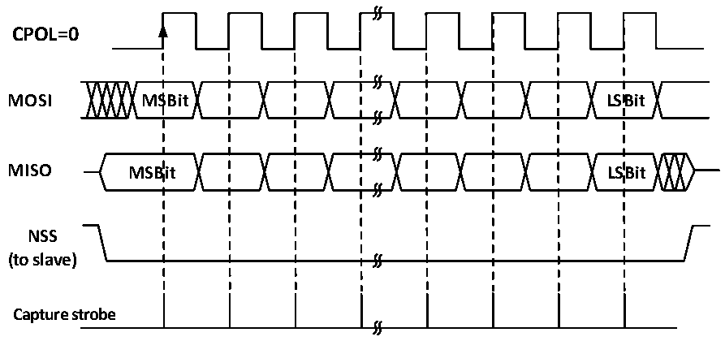

<!-- source-page: 221 -->

[← p.220](0220.md) · [index](../README.md) · [PDF p.221](https://ch32-riscv-ug.github.io/CH32V006/datasheet_en/CH32V00XRM.PDF#page=221) · [p.222 →](0222.md)

<!-- header: CH32V00X Reference Manual https://wch-ic.com -->

### 16.2.2 Master Mode

When the SPI module works in the main mode, the serial clock is generated by the SCK. Configure to main mode  
to perform the following steps:  
Configure the BR [2:0] field of the control register to determine the clock;  
Configure the CPOL and CPHA bits to determine the SPI mode;  
Configure DEF to determine data word length;  
Configure LSBFIRST to determine frame format;  
Configure the NSS pin, such as setting the SSOE bit to let the hardware set the NSS. You can also set the SSM bit  
and make the SSI position high;  
To set the MSTR bit and the SPE bit, you need to make sure that the NSS is already high.  
When you need to transmit data, you only need to write the data to be transmitted to the data register. SPI will  
send the data from the send buffer to the shift register in parallel, and then send the data from the shift register as  
set by LSBFIRST. When the data has reached the shift register, the TXE flag will be set, and if TXEIE has been  
set, an interrupt will occur. If the TXE flag position bit needs to fill the data register, maintain the complete data  
flow.  
When the receiver receives the data, when the last sampling clock edge of the data word arrives, the data is  
transferred from the shift register to the receive buffer in parallel, the RXNE bit is set, and an interrupt occurs if  
the RXNEIE bit is previously set. At this point, the data register should be read and the data should be removed as  
soon as possible.  

Figure 16-2 SPI master mode read/write mode 0  
 <!-- rendered from the PDF; verify at https://ch32-riscv-ug.github.io/CH32V006/datasheet_en/CH32V00XRM.PDF#page=221 -->

# MODE 0

# CPHA=0

🖼 Text parsed from the figure above

<strong>CPOL=0</strong>  
<strong>MOSI MSBit LSBit</strong>  
<strong>MISO MSBit LSBit</strong>  
<strong>NSS</strong>  
<strong>(to slave)</strong>  
<strong>Capture strobe</strong>  

<!-- image: p221-draw-image-00001 bbox=[515.88, 783.6, 534.96, 793.8] -->
<!-- footer: V1.5 215 -->
