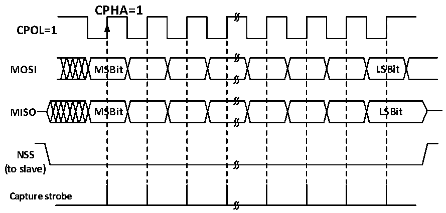

<!-- source-page: 223 -->

[← p.222](0222.md) · [index](../README.md) · [PDF p.223](https://ch32-riscv-ug.github.io/CH32V006/datasheet_en/CH32V00XRM.PDF#page=223) · [p.224 →](0224.md)

<!-- header: CH32V00X Reference Manual https://wch-ic.com -->

Figure 16-5 SPI master mode read/write mode 3  
 <!-- rendered from the PDF; verify at https://ch32-riscv-ug.github.io/CH32V006/datasheet_en/CH32V00XRM.PDF#page=223 -->

# MODE 3

🖼 Text parsed from the figure above

CPHA=1  
<strong>CPOL=1</strong>  
<strong>MOSI MSBit LSBit</strong>  
<strong>MISO MSBit LSBit</strong>  
<strong>NSS</strong>  
<strong>(to slave)</strong>  
<strong>Capture strobe</strong>  

### 16.2.3 Slave Mode

When the SPI module works in slave mode, SCK is used to receive the clock sent by the host, and its own baud  
rate setting is invalid. The steps to configure to slave mode are as follows:  
Configure the DEF bit to set the data bit length;  
Configure CPHA to match the host operating mode;  
The working mode of SPI is determined according to the configuration of transceiver and CPOL.  
If you need to send in slave mode, you need to set CPOL to mode 2 or mode 3, and the host will change the  
configuration as needed.  
If you only need to receive from the mode, you only need to match the host CPOL mode.  
Configure LSBFIRST to match host data frame format;  
In hardware management mode, the NSS pin needs to be kept low. If NSS is set to software management (SSM  
setting), please keep the SSI not set.  
Clear MSTR bit, set SPE bit, turn on SPI mode.  
At the time of transmission, when the first slave receiving sampling edge appears in the SCK, the slave starts  
sending. The process of sending is that the data of the send buffer is moved to the send shift register. When the  
data of the send buffer is moved to the shift register, the TXE flag will be set. If the TXEIE bit is set before, then  
an interrupt will occur.  
When receiving, after the last clock sampling edge, the RXNE bit is set, the bytes received by the shift register are  
transferred to the receiving buffer, and the data in the receiving buffer can be obtained by reading the data register.  
If the RXNEIE is set before the RXNE is set, an interruption occurs.  
<!-- image: p223-draw-image-00001 bbox=[515.88, 783.6, 534.96, 793.8] -->
<!-- footer: V1.5 217 -->
