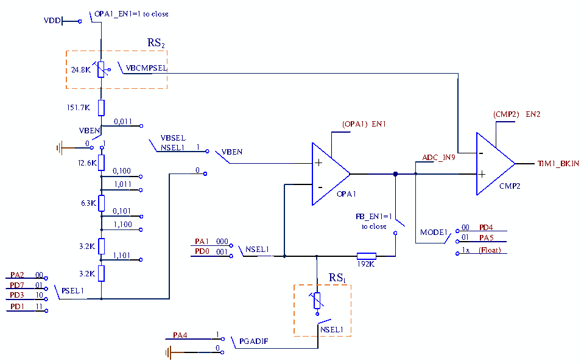

<!-- source-page: 234 -->

[← p.233](0233.md) · [index](../README.md) · [PDF p.234](https://ch32-riscv-ug.github.io/CH32V006/datasheet_en/CH32V00XRM.PDF#page=234) · [p.235 →](0235.md)

<!-- header: CH32V00X Reference Manual https://wch-ic.com -->

Figure 17-1 OPA structure diagram  
 <!-- rendered from the PDF; verify at https://ch32-riscv-ug.github.io/CH32V006/datasheet_en/CH32V00XRM.PDF#page=234 -->

🖼 Text parsed from the figure above

c  
OPA1_EN1=1 to close  
VDD  
RS2  
24.8K  VBCMPSEL  
151.7K  
(CMP2) EN2  
0,011 (OPA1) EN1  
VBEN  
VBSEL  
0 1  
NSEL1 1 VBEN -  
12.6K + ADC_IN9 TIM1_BKIN  
0,100 0 +  
1,011 - CMP2  
OPA1  
6.3K  
0,101  
FB_EN1=1  
1,100 to close 00 PD4  
MODE1  
01 PA5  
PA1 000  
3.2K PD0 001 NSEL1 1x (Float)  
1,101  
192K  
PA2 00 3.2K RS  
1  
PD7 01  
PSEL1  
PD3 10  
PD1 11  
NSEL1  
PA4 1  
PGADIF  
0  

RS  
RS1 2  
64K 27.4K 12.8K 6.2K 12.4K 00  
c c  
VBCMPSEL  
011 100 101 110 6.2K 01  
6.2K  
10  
NSEL1  

#### 17.2.1.1 OPA Single-ended Input

In the OPA_CTLR1 register: configure PSEL1 bit to select OPA1 positive and negative pin input; configure  
MODE1 bit to select OPA1 positive and negative pin output, and the corresponding pin is configured as analog  
input. After OPA_EN1 position 1 enables OPA1, the external pin can be linked internally.  
<em>Note: External access feedback resistor can be selected when using stand-alone OPA1.</em>  
<!-- image: p234-draw-image-00001 bbox=[515.88, 783.6, 534.96, 793.8] -->
<!-- footer: V1.5 228 -->
