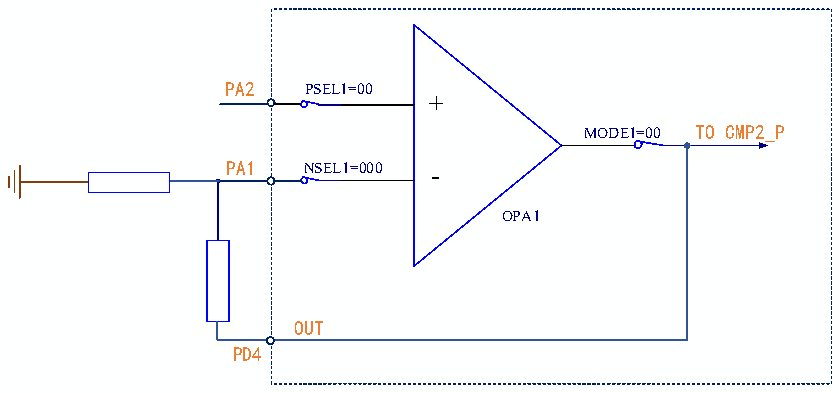

<!-- source-page: 235 -->

[← p.234](0234.md) · [index](../README.md) · [PDF p.235](https://ch32-riscv-ug.github.io/CH32V006/datasheet_en/CH32V00XRM.PDF#page=235) · [p.236 →](0236.md)

<!-- header: CH32V00X Reference Manual https://wch-ic.com -->

Figure 17-2 Schematic diagram of OPA single-ended input  
 <!-- rendered from the PDF; verify at https://ch32-riscv-ug.github.io/CH32V006/datasheet_en/CH32V00XRM.PDF#page=235 -->

🖼 Text parsed from the figure above

PA2 PSEL1=00  
+  
MODE1=00 TO CMP2_P  
PA1 NSEL1=000 -  
OPA1  
OUT  
PD4  

Configuration actions:  
1. Unlock OPA:  
Write KEY1 = 0x45670123 to OPA_KEY register (The first step must be KEY1);  
Write KEY2 = 0xCDEF89AB to OPA_KEY register (The second step must be KEY2).  
2. Select OPA pin:  
In the OPA_CTLR1 register: Configure the PSEL1 bit to 00b (PA2), NSEL1 bit to 000b (PA1), and MODE1 bit to  
00b (PD4).  
3. In the OPA_CTLR1 register: Configure the OPA_EN1 bit to 1, enable OPA1.  

#### 17.2.1.2 OPA Built-in Programmable PGA

In the OPA_CTLR1 register: configure the PGADIF bit to 0, select the OPA single-ended mode, so that the  
negative input is internally grounded; configure the NSEL1 bit to be 011bUniple 100b, 101bpx10b, 1010b, the  
gain is: 4pinch 816shock 32, and FB_EN1 position 1, enable the internal feedback resistance; configure the  
PSEL1 bit to select the positive input; configure the OPA_EN1 bit to 1, enable OPA1.  
<em>Note:</em>  
<em>1) In internally programmable PGA mode, the external pin only needs the input and output of the positive end</em>  
<em>of the OPA, and the negative input defaults to the internal ground.</em>  
<em>2) After selecting the gain, in order to avoid output saturation, the input voltage should be lower than VDD</em>  
<em>divided by the gain multiple.</em>  
<!-- image: p235-draw-image-00001 bbox=[515.88, 783.6, 534.96, 793.8] -->
<!-- footer: V1.5 229 -->
