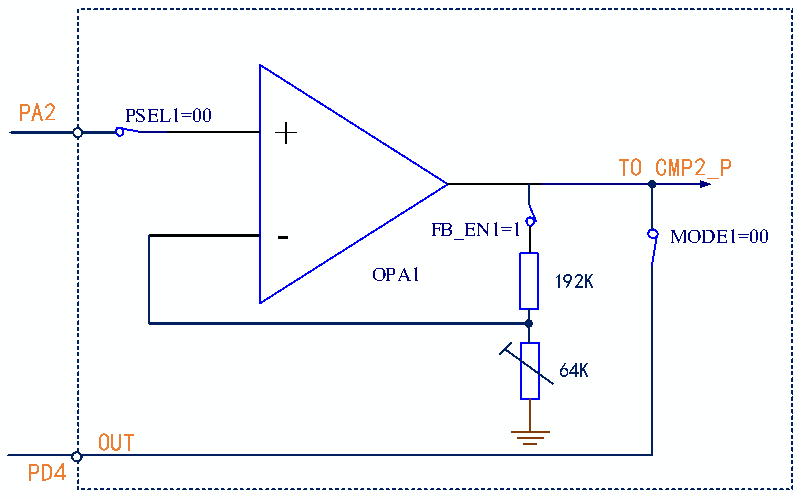

<!-- source-page: 236 -->

[← p.235](0235.md) · [index](../README.md) · [PDF p.236](https://ch32-riscv-ug.github.io/CH32V006/datasheet_en/CH32V00XRM.PDF#page=236) · [p.237 →](0237.md)

<!-- header: CH32V00X Reference Manual https://wch-ic.com -->

Figure 17-3 Schematic diagram of OPA internal programmable PGA  
 <!-- rendered from the PDF; verify at https://ch32-riscv-ug.github.io/CH32V006/datasheet_en/CH32V00XRM.PDF#page=236 -->

🖼 Text parsed from the figure above

PA2  
PSEL1=00  
+  
TO CMP2_P  
FB_EN1=1  
MODE1=00  
OPA1 192K  
64K  
OUT  
PD4  

Configuration actions:  
1. Unlock OPA:  
Write KEY1 = 0x45670123 to OPA_KEY register (The first step must be KEY1);  
Write KEY2 = 0xCDEF89AB to OPA_KEY register (The second step must be KEY2).  
2. Select OPA pin:  
In the OPA_CTLR1 register: Configure the PSEL1 bit to 00b (PA2), NSEL1 bit to 000b (PA1), and MODE1 bit to  
00b (PD4).  
3. In the OPA_CTLR1 register: Configure the OPA_EN1 bit to 1, enable OPA1.  

#### 17.2.1.3 OPA Differential Input

In the OPA_CTLR1 register: configure the PGADIF bit to 1 to select the OPA differential input PGA mode. At  
this time, the negative input is PA4; configure the NSEL1 bit 011b/100b/101b, the PGA gain is: 4/8/16, and the  
FB_EN1 bit is 1 to enable the internal feedback resistor; configure the PSEL1 bit to select the positive input;  
configure the OPA_EN1 bit to 1 to enable OPA1.  
<!-- image: p236-draw-image-00001 bbox=[515.88, 783.6, 534.96, 793.8] -->
<!-- footer: V1.5 230 -->
