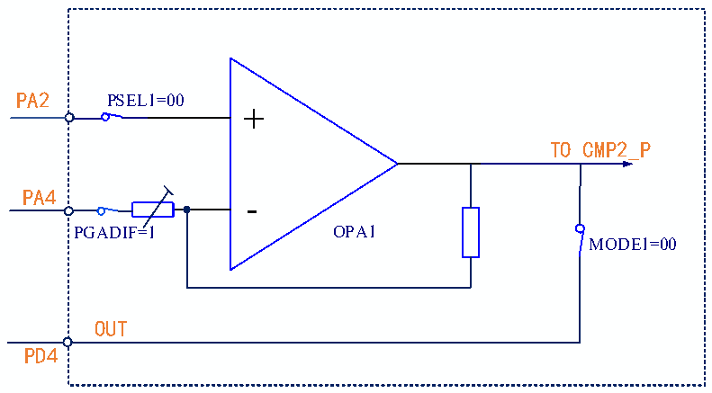
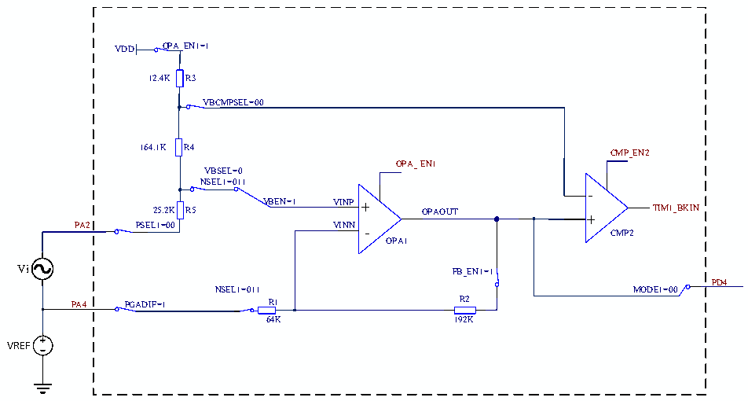

<!-- source-page: 237 -->

[← p.236](0236.md) · [index](../README.md) · [PDF p.237](https://ch32-riscv-ug.github.io/CH32V006/datasheet_en/CH32V00XRM.PDF#page=237) · [p.238 →](0238.md)

<!-- header: CH32V00X Reference Manual https://wch-ic.com -->

Figure 17-4 Schematic diagram of OPA differential input  
 <!-- rendered from the PDF; verify at https://ch32-riscv-ug.github.io/CH32V006/datasheet_en/CH32V00XRM.PDF#page=237 -->

🖼 Text parsed from the figure above

PA2 PSEL1=00  
+  
TO CMP2_P  
PA4 -  
PGADIF=1 OPA1  
MODE1=00  
OUT  
PD4  

#### 17.2.1.4 OPA Self-biased Differential PGA

When the OPA uses differential PGA, the bias voltage can be increased, and the output voltage can be connected  
to the positive input of the CMP2, and then compared with the negative reference voltage.  
In the OPA_CFGR2 register: configure the RST_EN2 bit to 1 to enable the CMP2 reset function, when the CMP  
output is a high-level complex system, or configure the BKIN_CFG bit of the OPA_CTLR2 register to 10b as the  
brake source of the TIM1.  

Figure 17-5 Schematic diagram of OPA self-offset differential PGA input  
 <!-- rendered from the PDF; verify at https://ch32-riscv-ug.github.io/CH32V006/datasheet_en/CH32V00XRM.PDF#page=237 -->

🖼 Text parsed from the figure above

VDD OPA_EN1=1  
12.4K R3  
VBCMPSEL=00  
164.1K R4  
CMP_EN2  
OPA_ EN1  
VBSEL=0  
NSEL1=011  
-  
25.2K R5 VBEN=1 VINP + OPAOUT TIM1_BKIN  
+  
PA2 PSEL1=00 VINN - CMP2  
OPA1  
Vi FB_EN1=1  
PD4  
NSEL1=011 MODE1=00  
PA4 PGADIF=1 R1 R2  
64K 192K  
VREF  

Configuration actions:  
1. Unlock OPA:  
Write KEY1 = 0x45670123 to OPA_KEY register (The first step must be KEY1);  
Write KEY2 = 0xCDEF89AB to OPA_KEY register (The second step must be KEY2).  
2. Select OPA pin:  
<!-- image: p237-draw-image-00001 bbox=[515.88, 783.6, 534.96, 793.8] -->
<!-- footer: V1.5 231 -->
