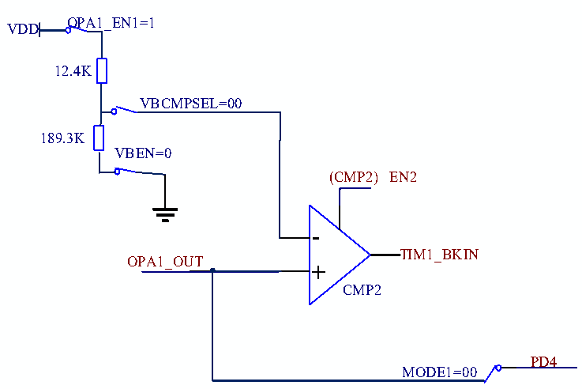

<!-- source-page: 239 -->

[← p.238](0238.md) · [index](../README.md) · [PDF p.239](https://ch32-riscv-ug.github.io/CH32V006/datasheet_en/CH32V00XRM.PDF#page=239) · [p.240 →](0240.md)

<!-- header: CH32V00X Reference Manual https://wch-ic.com -->

Figure 17-6 Schematic diagram of CMP2 independent bias mode  
 <!-- rendered from the PDF; verify at https://ch32-riscv-ug.github.io/CH32V006/datasheet_en/CH32V00XRM.PDF#page=239 -->

🖼 Text parsed from the figure above

OPA1_EN1=1  
VDD  
12.4K  
VBCMPSEL=00  
189.3K  
VBEN=0  
(CMP2) EN2  
-  
TIM1_BKIN  
OPA1_OUT  
+  
CMP2  
PD4  
MODE1=00  

Configuration actions:  
1. Unlock OPA:  
Write KEY1 = 0x45670123 to OPA_KEY register (The first step must be KEY1);  
Write KEY2 = 0xCDEF89AB to OPA_KEY register (The second step must be KEY2).  
2. Select OPA pin:  
In OPA_CTLR1 register: Configure OPA_EN1 bit to 1, enable OPA1.  
3. Configure VBEN to 0b, enable output voltage bias.  
4. CMP unlock:  
Write KEY1 = 0x45670123 to CMP_KEY register (The first step must be KEY1);  
Write KEY2 = 0xCDEF89AB to CMP_KEY register (The second step must be KEY2).  
5. In the OPA_CTLR1 register: Configure the VBCMPSEL bit to 00b and give the reference voltage at the  
negative end of the CMP2.  
6. In the OPA_CFGR2 register: Configure BKIN_CFG to 10b as the brake source of TIM1.  
7. In the OPA_CFGR2 register: Configure the CMP_EN2 bit to 1, enable CMP2.  

### 17.2.2 OPA Positive Input Polling

The P terminals of OPA can be selected from OPA_P0/OPA_P1/OPA_P2/OPA_P3, and the number of channels to  
be polled can be configured through the POLL1_NUM in the OPA_CFGR1 register, and up to three channels can  
be selected; the polling function of OPA can be realized by selecting the OPA_P0/OPA_P1/OPA_P2/OPA_P3 in  
turn. The polling function of OPA can realize to select OPA_P0/OPA_P1/OPA_P2/OPA_P3 sequentially at regular  
intervals to select all P terminals in turn; OPA polling order can be set by configuring the POLL_CHx bit in the  
OPA_CFGR1 register, and POLL_EN bit can be configured to turn on the polling of the positive end of OPA1.  
<!-- image: p239-draw-image-00001 bbox=[515.88, 783.6, 534.96, 793.8] -->
<!-- footer: V1.5 233 -->
