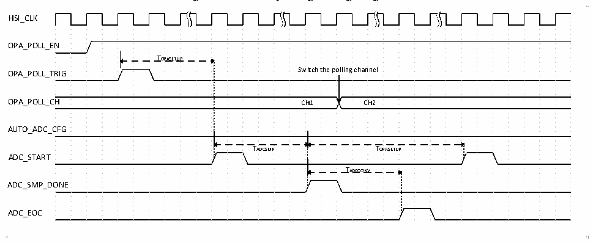
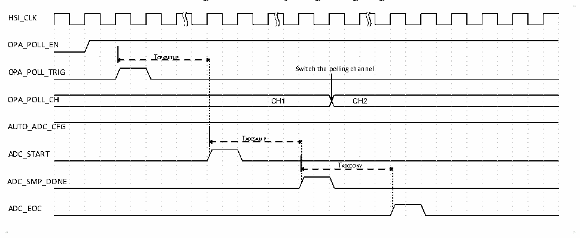

<!-- source-page: 240 -->

[← p.239](0239.md) · [index](../README.md) · [PDF p.240](https://ch32-riscv-ug.github.io/CH32V006/datasheet_en/CH32V00XRM.PDF#page=240) · [p.241 →](0241.md)

<!-- header: CH32V00X Reference Manual https://wch-ic.com -->

Figure 17-7 OPA polling timing diagram 1  
 <!-- rendered from the PDF; verify at https://ch32-riscv-ug.github.io/CH32V006/datasheet_en/CH32V00XRM.PDF#page=240 -->

🖼 Text parsed from the figure above

HSI_CLK  
OPA_POLL_EN  
TOPASETUP  
OPA_POLL_TRIG Switch the polling channel  
OPA_POLL_CH CH1 CH2  
AUTO_ADC_CFG  
TADCSMP TOPASETUP  
ADC_START  
TADCCONV  
ADC_SMP_DONE  
ADC_EOC  

TOPASETUP: OPA establishment time.  
TADCSMP: ADC sampling time.  
TADCCONV: ADC conversion time.  
As shown in Figure 17-7, when the AUTO_ADC_CFG bit is configured to 0, after the configured polling trigger  
event occurs, the ADC starts to sample after TOPASETUP, after the sampling is completed, the polling channel is  
switched, and then after TOPASETUP again (Note: the setup OPA establishment time needs to be greater than the  
ADC conversion time), the next ADC sampling is performed, and the ADC sampling is repeated after the process.  

Figure 17-8 OPA polling timing diagram 2  
 <!-- rendered from the PDF; verify at https://ch32-riscv-ug.github.io/CH32V006/datasheet_en/CH32V00XRM.PDF#page=240 -->

🖼 Text parsed from the figure above

HSI_CLK  
OPA_POLL_EN  
TOPASETUP  
OPA_POLL_TRIG Switch the polling channel  
OPA_POLL_CH CH1 CH2  
AUTO_ADC_CFG  
TADCSAMP  
ADC_START  
TADCCONV  
ADC_SMP_DONE  
ADC_EOC  

TOPASETUP: OPA establishment time.  
TADCSMP: ADC sampling time.  
TADCCONV: ADC conversion time.  
As shown in Figure 17-8, when the AUTO_ADC_CFG bit is configured to 1, after the configured polling trigger  
event occurs, the ADC starts to sample after TOPASETUP, and the polling channel is switched after the sampling  
is completed; wait for the subsequent polling trigger event to occur again and repeat the above process.  
Recommendation: In practice, if the ADC conversion time is greater than the OPA establishment time, it is  
recommended that the AUTO_ADC_CFG bit be configured to 1 to work with the ADC scanning mode; if the  
ADC conversion time is less than the OPA establishment time, it is recommended that the AUTO_ADC_CFG bit  
be configured to 0 to work with the ADC one-shot mode.  
<!-- image: p240-draw-image-00001 bbox=[515.88, 783.6, 534.96, 793.8] -->
<!-- footer: V1.5 234 -->
