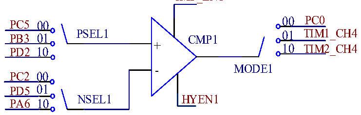

<!-- source-page: 241 -->

[← p.240](0240.md) · [index](../README.md) · [PDF p.241](https://ch32-riscv-ug.github.io/CH32V006/datasheet_en/CH32V00XRM.PDF#page=241) · [p.242 →](0242.md)

<!-- header: CH32V00X Reference Manual https://wch-ic.com -->

### 17.2.3 CMP

Setting the CMP_ENx in the OPA_CTLR2 register enables the corresponding CMPx.  
In the OPA_CTLR2 register: configure MODE1 bit to select the output channel of CMP1; configure PSEL1 to  
select the positive input pin of CMP1; configure NSEL1 to select the negative input pin of CMP1.  
The CMP2 positive input pin comes from the OPA1 output and can select the channel through the MODE1 bit in  
the OPA_CTLR1 register; the negative reference voltage is controlled by the VBCMPSEL bit in the OPA_CTLR  
register and is valid only in VBEN=1. The output of CMP2 is used as the brake source of TIM1.  

Figure 17-9 CMP structure diagram  
 <!-- rendered from the PDF; verify at https://ch32-riscv-ug.github.io/CH32V006/datasheet_en/CH32V00XRM.PDF#page=241 -->

CMP_EN1  

🖼 Text parsed from the figure above

00 PC0  
PC5 00  
PB3 01 PSEL1 CMP1 01 TIM1_CH4  
PD2 10 + 10 TIM2_CH4  
MODE1  
PC2 00  
PD5 01  
NSEL1 HYEN1  
PA6 10  

## 17.3 Register Description

<!-- p241-table-001 (table-17-4@1) -->
<table><caption>Table 17-4 OPA-related registers list</caption><tr><th>Name</th><th>Offset address</th><th>Description</th><th>Reset value</th></tr><tr><td>R32_OPA_CFGR1</td><td>0x40024000</td><td>OPA Configuration Register 1</td><td>0x00000000</td></tr><tr><td>R32_OPA_CTLR1</td><td>0x40024004</td><td>OPA Control Register 1</td><td>0x800C0736</td></tr><tr><td>R32_OPA_CFGR2</td><td>0x40024008</td><td>OPA Configuration Register 2</td><td>0x00000000</td></tr><tr><td>R32_OPA_CTLR2</td><td>0x4002400C</td><td>OPA Control Register 2</td><td>0x80000078</td></tr><tr><td>R32_OPA_KEY</td><td>0x40024010</td><td>OPA Lock Key Register</td><td>0xXXXXXXXX</td></tr><tr><td>R32_CMP_KEY</td><td>0x40024014</td><td>CMP Unlock Key Register</td><td>0xXXXXXXXX</td></tr><tr><td>R32_POLL_KEY</td><td>0x40024018</td><td>POLL Lock Key Register</td><td>0xXXXXXXXX</td></tr></table>

### 17.3.1 OPA Configuration Register 1 (OPA_CFGR1)

Offset address: 0x00  

<!-- p241-table-002 (table-17-4@1) -->
<table class="bitfield"><colgroup><col style="width:6.2500%"><col style="width:6.2500%"><col style="width:6.2500%"><col style="width:6.2500%"><col style="width:6.2500%"><col style="width:6.2500%"><col style="width:6.2500%"><col style="width:6.2500%"><col style="width:6.2500%"><col style="width:6.2500%"><col style="width:6.2500%"><col style="width:6.2500%"><col style="width:6.2500%"><col style="width:6.2500%"><col style="width:6.2500%"><col style="width:6.2500%"></colgroup><tr><th>31</th><th>30</th><th>29</th><th>28</th><th>27</th><th>26</th><th>25</th><th>24</th><th>23</th><th>22</th><th>21</th><th>20</th><th>19</th><th>18</th><th>17</th><th>16</th></tr><tr><td>POLL_LOCK</td><td colspan="3">Reserved</td><td colspan="3">POLL_SEL</td><td>POLL_SWSTRT</td><td colspan="2">Reserved</td><td colspan="2">POLL_CH3</td><td colspan="2">POLL_CH2</td><td colspan="2">POLL_CH1</td></tr></table>

<!-- p241-table-003 (table-17-4@1) -->
<table class="bitfield"><colgroup><col style="width:6.2500%"><col style="width:6.2500%"><col style="width:6.2500%"><col style="width:6.2500%"><col style="width:6.2500%"><col style="width:6.2500%"><col style="width:6.2500%"><col style="width:6.2500%"><col style="width:6.2500%"><col style="width:6.2500%"><col style="width:6.2500%"><col style="width:6.2500%"><col style="width:6.2500%"><col style="width:6.2500%"><col style="width:6.2500%"><col style="width:6.2500%"></colgroup><tr><th>15</th><th>14</th><th>13</th><th>12</th><th>11</th><th>10</th><th>9</th><th>8</th><th>7</th><th>6</th><th>5</th><th>4</th><th>3</th><th>2</th><th>1</th><th>0</th></tr><tr><td>Reserved</td><td>IF_OUT_POLL_CH3</td><td>IF_OUT_POLL_CH2</td><td>IF_OUT_POLL_CH1</td><td>Reserved</td><td>NMI_EN</td><td>Reserved</td><td>IE_OUT1</td><td>AUTO_ADC_CFG</td><td colspan="2">SETUP_CFG</td><td>RST_EN1</td><td colspan="2">POLL1_NUM</td><td>Reserved</td><td>POLL_EN</td></tr></table>

<!-- p241-table-004 (table-17-4@1) pages 241-243 -->
<table><tr><th>Bit</th><th>Name</th><th>Access</th><th>Description</th><th>Reset value</th></tr><tr><td>31</td><td>POLL_LOCK</td><td>RO</td><td style="text-align:left">POLL lock: 1: POLL lock; 0: POLL unlock. Note: The module is not reset and this bit cannot be unlocked.</td><td>0</td></tr><tr><td>[30:28]</td><td>Reserved</td><td>RO</td><td>Reserved</td><td>0</td></tr><tr><td>[27:25]</td><td>POLL_SEL</td><td>RW</td><td style="text-align:left">OPA polling trigger event selection: 000: Software configuration; 001: TIM1_CH4; 010: TIM2_CH4; 011: TIM3_CH1; 100: TIM3_CH2; Other: Reserved.</td><td>0</td></tr><tr><td>24</td><td>POLL_SWSTRT</td><td>WO</td><td style="text-align:left">To start OPA polling, you need to set a software trigger. 1: Start OPA polling; 0: Reset status. This bit is set by software, and the hardware is cleared 0 after polling starts.</td><td>0</td></tr><tr><td>[23:22]</td><td>Reserved</td><td>RO</td><td>Reserved</td><td>0</td></tr><tr><td>[21:20]</td><td>POLL_CH3</td><td>RW</td><td style="text-align:left">OPA polling order: Configure the 3rd polling channel.</td><td>0</td></tr><tr><td>[19:18]</td><td>POLL_CH2</td><td>RW</td><td style="text-align:left">OPA polling order: Configure the 2nd polling channel.</td><td>0</td></tr><tr><td>[17:16]</td><td>POLL_CH1</td><td>RW</td><td style="text-align:left">OPA polling order: Configure the 1st polling channel.</td><td>0</td></tr><tr><td>15</td><td>Reserved</td><td>RO</td><td>Reserved</td><td>0</td></tr><tr><td>14</td><td style="text-align:left">IF_OUT_POLL_CH3</td><td>RW0</td><td style="text-align:left">The 3rd polling channel polls the OPA1 for high output interrupt flags: 1: OPA output is high; 0: Invalid.</td><td>0</td></tr><tr><td>13</td><td style="text-align:left">IF_OUT_POLL_CH2</td><td>RW0</td><td style="text-align:left">The 2nd polling channel polls the OPA1 for high output interrupt flags: 1: OPA output is high; 0: Invalid.</td><td>0</td></tr><tr><td>12</td><td style="text-align:left">IF_OUT_POLL_CH1</td><td>RW0</td><td style="text-align:left">The 1std polling channel polls the OPA1 for high output interrupt flags: 1: OPA output is high; 0: Invalid.</td><td>0</td></tr><tr><td>11</td><td>Reserved</td><td>RO</td><td>Reserved</td><td>0</td></tr><tr><td>10</td><td>NMI_EN</td><td>RW</td><td style="text-align:left">OPA connection NMI interrupt enable: 1: Enable; 0: Disable.</td><td>0</td></tr><tr><td>9</td><td>Reserved</td><td>RO</td><td>Reserved</td><td>0</td></tr><tr><td>8</td><td>IE_OUT1</td><td>RW</td><td style="text-align:left">OPA1 interrupt enable: 1: Turn on interrupt enable; 0: Turn off interrupt enable.</td><td>0</td></tr><tr><td>7</td><td>AUTO_ADC_CFG</td><td>RW</td><td style="text-align:left">OPA polling automatically triggers ADC transformation configuration bits: 1: Under the polling function, OPA switches channels after ADC sampling ends; 0: Under the polling function, after the ADC sampling ends, the OPA switches the channel, and the ADC conversion is automatically triggered after the SETUP_CFG setting time.</td><td>0</td></tr><tr><td>[6:5]</td><td>SETUP_CFG</td><td>RW</td><td style="text-align:left">OPA establishes the time configuration. After establishing the time, the ADC conversion will be triggered: 00, 10: 0.5μs; 01: 0.312μs; 11: 0.77μs.</td><td>0</td></tr><tr><td>4</td><td>RST_EN1</td><td>RW</td><td style="text-align:left">OPA1 reset system enable: 1: Enable the OPA1 reset function. The result of OPA1 polling is that the system will be reset at high power level. 0: Disable the OPA1 reset function</td><td>0</td></tr><tr><td>[3:2]</td><td>POLL1_NUM</td><td>RW</td><td style="text-align:left">Configure the number of positive ends of OPA1 polling: 00: Poll 1 channel; 01: Poll 2 channel; 10: Poll 3 channel; 11: Reserved. Note: The polling order is configurable.</td><td>0</td></tr><tr><td>1</td><td>Reserved</td><td>RO</td><td>Reserved</td><td>0</td></tr><tr><td>0</td><td>POLL_EN</td><td>RW</td><td style="text-align:left">OPA1 front-end polling enable: 1: Turn on the OPA1 front-end polling enable; 0: Turn off the OPA1 front-end polling enable.</td><td>0</td></tr></table>

<!-- image: p241-draw-image-00001 bbox=[515.88, 783.6, 534.96, 793.8] -->
<!-- footer: V1.5 235 -->
